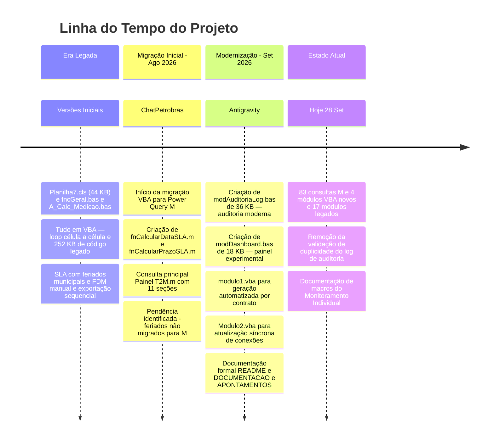

# Análise Completa do Projeto e Sugestões de Melhoria

## Painel de Controle MemoriaPetrobras V6 — Diagnóstico Holístico

**Data da análise:** 28/09/2026  
**Analista:** Antigravity AI  
**Escopo:** Análise exaustiva do repositório `D:\PainelNovo`, incluindo código legado, código novo, pipeline Power Query M, documentação existente, histórico de decisões e oportunidades de evolução.

---

## Parte I — Retrato do Projeto

### 1. O Que o Sistema Faz

O **Painel de Controle MemoriaPetrobras V6** é uma solução corporativa de medição contratual que transforma milhares de registros operacionais de atendimentos (solicitações de serviço, ordens de serviço) em documentos de faturamento auditáveis para 4 contratos regionais da Petrobras:

| Contrato | Região | Nº SAP |
|:---|:---|:---|
| `PA-LT2` | Bahia | `4600687006` |
| `IRON-LT1-RJ` | Rio de Janeiro | `4600686987` |
| `IRON-LT1-SP` | São Paulo | `4600686987` |
| `IRON-LT1-ES` | Espírito Santo | `4600686987` |

O ciclo de vida completo é:


---

### 2. Cronologia e Evolução Histórica



---

### 3. Inventário Completo do Código

#### 3.1 Código VBA Novo (4 módulos, 84 KB)

| Módulo | Tamanho | Responsabilidade |
|:---|---:|:---|
| [modAuditoriaLog.bas](file:///d:/PainelNovo/Codes/VBA/Funções%20Novas/modAuditoriaLog.bas) | 36.5 KB | Motor de auditoria com mapeamento dinâmico de colunas, classificação CRÍTICO/ALERTA, relatório LOG_CRITICAS |
| [modulo1.vba](file:///d:/PainelNovo/Codes/VBA/Funções%20Novas/modulo1.vba) | 21.9 KB | Geração de 4 arquivos .xlsx por contrato (MC, ARM, DADOS, FRETE) |
| [modDashboard.bas](file:///d:/PainelNovo/Codes/VBA/Funções%20Novas/modDashboard.bas) | 18.0 KB | Painel experimental de KPIs e cards visuais |
| [Modulo2.vba](file:///d:/PainelNovo/Codes/VBA/Funções%20Novas/Modulo2.vba) | 7.5 KB | Atualização síncrona de todas as conexões Power Query |

#### 3.2 Código VBA Legado (17 módulos, 252 KB)

| Módulo | Tamanho | Papel Original |
|:---|---:|:---|
| [Planilha7.cls](file:///d:/PainelNovo/Codes/VBA/FuncoesAntigas/Planilha7.cls) | 44.3 KB | Motor principal legado: `analiseDeDados`, FDM, SLA, validações |
| [A_Calc_Medicao.bas](file:///d:/PainelNovo/Codes/VBA/FuncoesAntigas/A_Calc_Medicao.bas) | 43.6 KB | Cálculo de medição e pagamento de itens |
| [subMCGuardaExterna.bas](file:///d:/PainelNovo/Codes/VBA/FuncoesAntigas/subMCGuardaExterna.bas) | 36.0 KB | Memória de Cálculo para guarda externa |
| [Planilha6.cls](file:///d:/PainelNovo/Codes/VBA/FuncoesAntigas/Planilha6.cls) | 23.8 KB | Operações específicas de aba |
| [fncTabelaB.bas](file:///d:/PainelNovo/Codes/VBA/FuncoesAntigas/fncTabelaB.bas) | 18.3 KB | Funções de busca dinâmica na TabelaB |
| [fncGeral.bas](file:///d:/PainelNovo/Codes/VBA/FuncoesAntigas/fncGeral.bas) | 16.5 KB | `calcular_dataSLA`, `ExibirMsg`, validações gerais |
| [B_Calc_ARM.bas](file:///d:/PainelNovo/Codes/VBA/FuncoesAntigas/B_Calc_ARM.bas) | 15.5 KB | Cálculo de armazenagem |
| [subDadosSaidaExportacao.bas](file:///d:/PainelNovo/Codes/VBA/FuncoesAntigas/subDadosSaidaExportacao.bas) | 13.7 KB | Exportação legada de dados |
| *+ 9 módulos menores* | ~53 KB | Edital, Rede, TabelaA, Frete, Log de versões, etc. |

#### 3.3 Código Power Query M (83 consultas, ~140 KB)

| Categoria | Consultas Principais | Papel |
|:---|:---|:---|
| **Pipeline Principal** | `Painel T2M.m` (25 KB), `Painel otimizado.m` (15 KB), `DADOS.m` | Ingestão, transformação e consolidação |
| **Motor de SLA** | `fnCalcularDataSLA.m`, `fnCalcularPrazoSLA.m` | Cálculo de prazo útil (sem feriados) |
| **Motor de FDM** | `fnClassificarFDM.m`, `fnCalcularFDMMensal.m`, `TabelaFDMPorContrato.m`, `fnRecalcularFDM.m`, `fnCalcularTSPE_TSPR.m`, `fnCalcularIAPFARQ.m` | Fator de Desempenho Mensal |
| **Motor de QExec** | `fnCalcularQExec.m`, `fnCalcularQExecAgrupado.m` | Quantidade Executada padronizada |
| **Períodos** | `fnGerarPeriodo.m`, `fnCalcularPeriodosAnteriores.m`, `fnValidarPeriodoAnterior.m` | Janela de faturamento 26 a 25 |
| **Tabelas de Referência** | 20+ consultas de Localidade, Centro, Galpão, PPU, Contrato, Grupo, Frete, etc. | Enriquecimento por merges |
| **Abas Regionais** | `ARM_*.m`, `DADOS_*.m`, `FRETE_*.m`, `ConsolidadoRJ/SP/ES/PA.m` | Separação por contrato |

#### 3.4 Documentação Existente (5 documentos)

| Documento | Tamanho | Conteúdo |
|:---|---:|:---|
| [README.md](file:///d:/PainelNovo/README.md) | 13 KB | Visão geral, arquitetura, regras, fluxo operacional |
| [DOCUMENTACAO_PROJETO.md](file:///d:/PainelNovo/DOCUMENTACAO_PROJETO.md) | 24 KB | Mapeamento técnico de 83 funções M, VBA e dicionário de dados |
| [APONTAMENTOS_E_MELHORIAS.md](file:///d:/PainelNovo/APONTAMENTOS_E_MELHORIAS.md) | 14 KB | Diagnóstico detalhado de bugs, riscos e plano de ação em 4 fases |
| [resumo_projeto_medicao_13-08-2026.txt](file:///d:/PainelNovo/resumo_projeto_medicao_13-08-2026.txt) | 28 KB | Histórico de decisões da migração VBA para M (ChatPetrobras) |
| [MANUAL_MODULO_AUDITORIA_LOG.md](file:///d:/PainelNovo/MANUAL_MODULO_AUDITORIA_LOG.md) | 13 KB | Manual operacional do módulo de auditoria |

---

## Parte II — Diagnóstico Consolidado

### 4. Problemas Identificados por Grau de Criticidade

#### 🔴 Críticos (Risco Financeiro / Glosa Contratual)

| # | Problema | Onde | Impacto |
|:---:|:---|:---|:---|
| **C1** | **SLA sem feriados no Power Query** | `fnCalcularDataSLA.m` usa apenas `Date.DayOfWeek <= 4` | Solicitações na véspera de feriados (Carnaval, 7/Set, feriados municipais de Macaé, Santos, Salvador) são marcadas como "Fora do Prazo" erroneamente — **glosa indevida, penalidade no FDM** |
| **C2** | **Divergência VBA vs M no SLA** | VBA legado (`fncGeral.bas`) consulta feriados; M não | A mesma solicitação produz resultado diferente dependendo do fluxo utilizado — **auditoria contratual inconsistente** |
| **C3** | **Caminhos absolutos na consulta principal** | `Painel T2M.m` Seção 1: `Folder.Files("C:\Users\DOK4\OneDrive...")` | Se outro técnico abrir o workbook em sua estação, todas as consultas falham — **indisponibilidade total** |

#### 🟡 Importantes (Operacionais / Performance)

| # | Problema | Onde | Impacto |
|:---:|:---|:---|:---|
| **I1** | **91 conexões atualizadas indiscriminadamente** | `Modulo2.vba` — loop `For Each cn In wb.Connections` | Consultas intermediárias, parâmetros e funções M são reavaliadas desnecessariamente — **tempo excessivo de atualização** |
| **I2** | **Conexões duplicadas/órfãs** | `FRETE_IRON-LT1-ES1`, `TabelaFDMPorContrato1`, etc. | Erros silenciosos (*"Query does not exist"*), atraso, confusão operacional |
| **I3** | **`Table.Buffer` cascateado na tabela fato** | `Painel T2M.m` — buffers em `ExpandirTabelaBuffer`, `FiltrarContratosBuffer`, etc. | Materializa centenas de milhares de células em RAM — **estouro de memória em volumes grandes** |
| **I4** | **Falso positivo de status verde** | `Modulo2.vba` linhas 124-133 — pinta verde mesmo com `iComErro > 0` | Usuário assume sucesso total quando houve falhas parciais — **medição incompleta sem alerta** |
| **I5** | **Contratos hardcoded no VBA** | `modulo1.vba` — arrays estáticos `ListaContratos()`, `ListaNumerosContrato()` | Novo lote ou renovação de contrato SAP exige alteração manual do código |
| **I6** | **Loop célula a célula em `ReplicarAlturasLinhas`** | `modulo1.vba` — itera `For iLin = 1 To ...` | Congela o Excel por minutos em planilhas com milhares de linhas |
| **I7** | **Erros silenciosos (`try...otherwise null`)** | Seções 10 e 11 da consulta M principal | Registros com dados inválidos desaparecem sem log — **dados perdidos sem rastreabilidade** |

#### 🟢 Menores (Qualidade / Manutenibilidade)

| # | Problema | Onde | Impacto |
|:---:|:---|:---|:---|
| **M1** | Fórmula `#NAME?` na aba Validações (D6) | Função gravada em português (`CÉLULA`) | Erro permanente na validação de caminhos |
| **M2** | Célula D10 com caminho fixo `C:\Thelmo\` | Aba Validações | Quebra em outra estação |
| **M3** | Bug de sobreposição no Dashboard | `modDashboard.bas` — `ConstruirFiltros` vs `ConstruirCards` escrevem na mesma linha 9 | Filtros são sobrescritos pelos KPIs |
| **M4** | `Application.EnableEvents` sem preservação de estado | `Modulo2.vba` | Interrupção inesperada deixa Excel com eventos desabilitados |
| **M5** | Duas versões da consulta principal coexistindo | `Painel T2M.m` vs `Painel otimizado.m` | Confusão sobre qual é a fonte oficial de cada aba |
| **M6** | Código legado de 252 KB ainda no `.xlsm` | 17 módulos em `FuncoesAntigas/` | Aumenta tamanho do arquivo, tempo de abertura e alertas de segurança |

---

### 5. O Que Já Está Bom e Deve Ser Preservado

> [!TIP]
> **Pontos fortes do projeto atual:**

1. **Arquitetura híbrida bem definida:** Separação clara entre Power Query M (ETL + cálculos) e VBA (orquestração + exportação) — estratégia correta de modernização gradual.
2. **Mapeamento dinâmico de colunas** em `modAuditoriaLog.bas` — robusto contra reordenação de colunas.
3. **Processamento em memória (Variant Arrays)** na auditoria — performance adequada para volumes corporativos.
4. **Classificação de severidade** (CRÍTICO/ALERTA) — priorização operacional eficaz para o gestor.
5. **Relatório LOG_CRITICAS** com estilização corporativa — excelente experiência de conferência.
6. **Versionamento Git** do código M e VBA — rastreabilidade de alterações já implementada.
7. **Documentação formal** com diagramas Mermaid — acima da média para projetos Excel corporativos.
8. **83 consultas M** organizadas por responsabilidade — pipeline de dados maduro.
9. **Geração automatizada** de 4 arquivos por contrato com naming convention e hyperlinks — operação padronizada.

---

## Parte III — Sugestões de Melhoria

### 6. Fase 1 — Correções Críticas (Prioridade Imediata)

#### 6.1 Integrar Feriados no Motor de SLA do Power Query

**O que:** Criar uma tabela de feriados (nacionais, estaduais e municipais) e alterar `fnCalcularDataSLA.m` para consultá-la.

**Como:**
```powerquery
// Exemplo de alteração na função TemExpediente dentro de fnCalcularDataSLA.m
TemExpediente = (data as date) as logical =>
    let
        dow = Date.DayOfWeek(data, Day.Monday),
        ehDiaUtil = dow <= 4,
        ehFeriado = Table.RowCount(
            Table.SelectRows(RefCalendarioFeriados, each [Data] = data)
        ) > 0
    in
        ehDiaUtil and not ehFeriado
```

**Origem dos dados:** A `TabelaB-V2.xlsx` já contém a tabela de feriados por município/UF (usada pelo VBA legado via `pesquisar_EFeriado`). Basta criar uma consulta M que a importe e a passe como parâmetro.

**Prioridade:** 🔴 **Imediata** — risco de glosa contratual em cada medição.

#### 6.2 Eliminar Caminhos Absolutos

**O que:** Substituir o caminho fixo `C:\Users\DOK4\OneDrive...` na Seção 1 da consulta por um parâmetro dinâmico.

**Como:**
```powerquery
// Em vez de:
// Fonte = Folder.Files("C:\Users\DOK4\OneDrive - PETROBRAS\...\Monitoramento\2026\07-Julho"),

// Usar:
CaminhoBase = Excel.CurrentWorkbook(){[Name="localMonitIndividualT2M"]}[Content]{0}[Column1],
Fonte = Folder.Files(CaminhoBase),
```

**Prioridade:** 🔴 **Imediata** — impede operação por qualquer pessoa que não seja o autor original.

#### 6.3 Corrigir Semáforo Visual de Status

**O que:** Implementar lógica de 3 cores na célula `Painel!B12` do `Modulo2.vba`.

**Regra:**
- 🟢 **Verde** → `iComErro = 0` (100% OK)
- 🟡 **Âmbar** → `iComErro > 0 And iComErro < totalConexoes` (sucesso parcial)
- 🔴 **Vermelho** → `iComErro = totalConexoes` (falha total)

**Prioridade:** 🟡 **Alta** — risco de medição incompleta despercebida.

---

### 7. Fase 2 — Otimizações de Performance

#### 7.1 Atualização Seletiva de Conexões

Em vez de atualizar 91 conexões, identificar as **tabelas finais** e atualizar apenas elas. O Power Query automaticamente resolve o grafo de dependências.

```vba
' Em vez de For Each cn In wb.Connections...
' Atualizar apenas as tabelas de destino:
Dim abasAlvo As Variant
abasAlvo = Array("DADOS", "ARM", "FRETE", "MC", _
                 "DADOS_PA-LT2", "DADOS_IRON-LT1-RJ", _
                 "DADOS_IRON-LT1-SP", "DADOS_IRON-LT1-ES")
' ... atualizar via ListObject.QueryTable.Refresh
```

**Ganho estimado:** Redução de 60-80% no tempo de atualização.

#### 7.2 Remover Table.Buffer da Tabela Fato

Manter `Table.Buffer` **apenas** nas tabelas de referência pequenas (Localidade, Centro, Grupo, PPU). Remover dos passos da tabela principal (`ExpandirTabelaBuffer`, `FiltrarContratosBuffer`, etc.).

**Ganho estimado:** Redução significativa do consumo de RAM e prevenção de estouro de memória em meses com grande volume.

#### 7.3 Substituir Loop de Altura de Linhas

Trocar `ReplicarAlturasLinhas` (loop célula a célula) por cópia nativa de aba:

```vba
' Em vez de loop:
wsOrigem.Copy After:=wbNovo.Worksheets(wbNovo.Worksheets.Count)
' Depois desconectar fórmulas:
wsDestino.UsedRange.Value = wsDestino.UsedRange.Value
```

**Ganho estimado:** De minutos para segundos na geração dos arquivos.

#### 7.4 Limpeza de Conexões Duplicadas/Órfãs

Criar um script de manutenção que remova as conexões sem consulta vinculada:

```vba
Sub LimparConexoesOrfas()
    Dim cn As WorkbookConnection
    For Each cn In ThisWorkbook.Connections
        On Error Resume Next
        Dim nomePQ As String
        nomePQ = cn.OLEDBConnection.CommandText
        If Err.Number <> 0 Then
            cn.Delete
        End If
        On Error GoTo 0
    Next cn
End Sub
```

---

### 8. Fase 3 — Governança e Rastreabilidade

#### 8.1 Tabela de Auditoria de Erros no Power Query

Criar uma consulta M paralela que capture registros descartados pelo `try...otherwise`:

```powerquery
// Ao invés de simplesmente "otherwise null":
AdicionarClassificacaoFDM = Table.AddColumn(..., each
    let resultado = try fnClassificarFDM(...) in
    if resultado[HasError] then
        [Classificacao = null, StatusPrazo = null,
         Log = "ERRO: " & resultado[Error][Message]]
    else resultado[Value]
)
```

Benefício: Criar uma aba `ERROS_TRANSFORMACAO` que mostra exatamente quais registros foram perdidos e por quê.

#### 8.2 Parametrização Dinâmica de Contratos

Criar tabela na aba `Validações`:

| Contrato | Número SAP | Sufixo | Status | Tipos de Aba |
|:---|:---|:---|:---|:---|
| PA-LT2 | 4600687006 | BA | Ativo | MC, ARM, DADOS, FRETE |
| IRON-LT1-RJ | 4600686987 |  | Ativo | MC, ARM, DADOS, FRETE |
| IRON-LT1-SP | 4600686987 |  | Ativo | MC, ARM, DADOS, FRETE |
| IRON-LT1-ES | 4600686987 |  | Ativo | MC, ARM, DADOS, FRETE |

E alterar `modulo1.vba` para ler dinamicamente dessa tabela, eliminando os arrays hardcoded.

#### 8.3 Consolidar a Fonte Oficial das Consultas

Definir formalmente se a fonte de verdade é `Painel T2M.m` ou `Painel otimizado.m`. Manter apenas uma como ativa e arquivar a outra como backup versionado.

---

### 9. Fase 4 — Evolução do Dashboard e UX

#### 9.1 Dashboard Baseado em Fórmulas (não em VBA)

Substituir o cálculo imperativo do `modDashboard.bas` por fórmulas nativas:

```
= CONT.SES(DADOS[Contrato], "PA-LT2")                        ' Registros por contrato
= SOMASES(DADOS[Qtd. Solicitada], DADOS[Contrato], "PA-LT2")  ' Volume por contrato
= CONT.SES(DADOS[Status Prazo], "NP")                         ' Dentro do prazo
= CONT.SES(DADOS[Status Prazo], "FP")                         ' Fora do prazo
```

**Vantagem:** O painel se atualiza automaticamente ao aplicar filtros ou segmentações de dados, sem precisar rodar macro.

#### 9.2 Tabela de Controle de Arquivos Gerados

Em vez de hyperlinks fixos em K7:K10, criar tabela estruturada:

| Contrato | Arquivo | Data Geração | Status | Ação |
|:---|:---|:---|:---|:---|
| PA-LT2 | 4600687006-PLA-...xlsx | 28/09/2026 14:30 | ✅ Gerado | Abrir |
| IRON-LT1-RJ | 4600686987-PLA-...xlsx | 28/09/2026 14:31 | ✅ Gerado | Abrir |

#### 9.3 Indicadores Visuais Sugeridos para o Painel

```
+---------------------------+---------------------------------------------------+
|     INDICADOR             |   DESCRIÇÃO                                       |
+---------------------------+---------------------------------------------------+
| Registros no Período      | Total de solicitações CO dentro da janela 26-25   |
| Qtd. Solicitada           | Soma geral de volumes solicitados                 |
| Qtd. Atendida             | Soma geral de volumes efetivamente atendidos      |
| QExec Total               | Quantidade executada padronizada (convertida)     |
| No Prazo (NP)             | Percentual de atendimentos dentro do SLA          |
| Fora do Prazo (FP)        | Percentual de atendimentos fora do SLA            |
| FDM por Contrato          | Indicador mensal de desempenho por contrato       |
| Erros de Auditoria        | Contador de pendências CRITICAS + ALERTAS         |
| Localidades sem Match     | Registros sem correspondência na TabelaB          |
| Última Atualização        | Data/hora do último RefreshAll concluído          |
+---------------------------+---------------------------------------------------+
```

---

### 10. Fase 5 — Redução de Complexidade e Dívida Técnica

#### 10.1 Remover Código Legado do .xlsm em Produção

Os 17 módulos legados (252 KB) devem ser **removidos do arquivo `.xlsm` de produção** e mantidos apenas versionados em `Codes/VBA/FuncoesAntigas/`. Isso:
- Reduz o tamanho do arquivo em ~250 KB
- Elimina alertas de segurança de macros redundantes
- Acelera o tempo de abertura do workbook
- Remove ambiguidade sobre qual código está ativo

#### 10.2 Unificar Regra de Meio Período (0,5 Dia)

A regra de 0,5 dia no `fnCalcularPrazoSLA.m` usa faixas fixas (8h-11h e 11h-16h) que devem ser auditadas com a fiscalização do contrato. Documentar formalmente a regra acordada e garantir que existe **uma única implementação** (em M), eliminando qualquer versão VBA paralela.

#### 10.3 Preservação de Estado do Excel

Implementar o padrão de captura/restauração em todos os módulos VBA:

```vba
' No início:
Dim bPrevEvents As Boolean
bPrevEvents = Application.EnableEvents

' Na saída (SairRotina e TratarErro):
Application.EnableEvents = bPrevEvents
```

> [!NOTE]
> O `modAuditoriaLog.bas` já implementa este padrão corretamente. Replicar nos demais módulos.

---

## Parte IV — Matriz de Priorização

| Fase | Ação | Esforço | Impacto | Prioridade |
|:---:|:---|:---:|:---:|:---:|
| 1 | Integrar feriados no SLA do Power Query | Médio | 🔴 Crítico | **P0** |
| 1 | Eliminar caminhos absolutos | Baixo | 🔴 Crítico | **P0** |
| 1 | Corrigir semáforo de status | Baixo | 🟡 Alto | **P1** |
| 2 | Atualização seletiva de conexões | Médio | 🟡 Alto | **P1** |
| 2 | Remover Table.Buffer da tabela fato | Baixo | 🟡 Alto | **P1** |
| 2 | Substituir loop de altura de linhas | Baixo | 🟡 Médio | **P2** |
| 2 | Limpar conexões duplicadas/órfãs | Baixo | 🟡 Médio | **P2** |
| 3 | Tabela de erros de transformação | Médio | 🟡 Alto | **P1** |
| 3 | Parametrização dinâmica de contratos | Médio | 🟡 Médio | **P2** |
| 3 | Consolidar consulta oficial | Baixo | 🟢 Baixo | **P3** |
| 4 | Dashboard com fórmulas nativas | Alto | 🟡 Médio | **P2** |
| 4 | Tabela de controle de arquivos | Médio | 🟢 Baixo | **P3** |
| 5 | Remover código legado do .xlsm | Baixo | 🟢 Baixo | **P3** |
| 5 | Unificar regra de 0,5 dia | Médio | 🟡 Médio | **P2** |
| 5 | Preservação de estado em todos os módulos | Baixo | 🟢 Baixo | **P3** |

---

## Parte V — Conclusão

O projeto está em um **estágio intermediário de maturidade** — avançou significativamente da era legada (tudo em VBA, célula a célula) para uma arquitetura moderna (Power Query M + VBA como orquestrador), mas ainda carrega dívida técnica que impõe riscos operacionais reais.

### Os 3 riscos mais urgentes são:
1. **Feriados ausentes no cálculo de SLA** — risco financeiro direto em cada medição
2. **Caminhos absolutos** — dependência de uma única estação de trabalho
3. **Status falso positivo** — medição incompleta sem visibilidade

### Os 3 maiores ganhos de curto prazo são:
1. **Atualização seletiva de conexões** — redução de 60-80% no tempo de processamento
2. **Remoção de Table.Buffer excessivos** — prevenção de estouro de memória
3. **Limpeza de conexões órfãs** — eliminação de erros silenciosos e confusão

A estratégia geral deve ser: **consolidar a verdade no Power Query M, manter o VBA apenas como camada de orquestração e exportação, e transformar o Painel em dashboard de indicadores com fórmulas nativas.**
