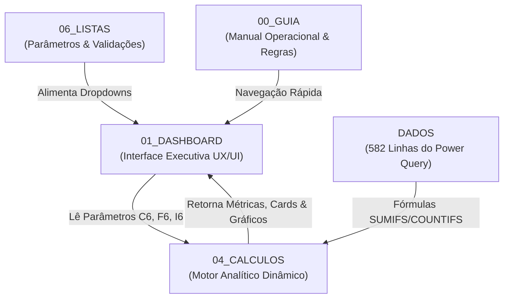

# 📊 MANUAL E ARQUITETURA DA DASHBOARD EXECUTIVA DE BI NO EXCEL
## Sistema de Medição e Memória de Cálculo — Contratos Petrobras

**Versão da Planilha:** `Painel de controle MemoriaPetrobras V6.xlsm`  
**Data da Implementação:** Setembro / 2026  
**Padrão Arquitetural:** 4 Camadas BI desacopladas (`00_GUIA`, `01_DASHBOARD`, `04_CALCULOS`, `06_LISTAS`)  
**Design System:** Executivo Corporativo Navy & Emerald (Tipografia Segoe UI, paleta HSL balanceada, cards de KPI, gráficos nativos e filtros dinâmicos)

---

## 1. 🔍 DIAGNÓSTICO DOS DADOS E AUDITORIA INICIAL

### 1.1 Volume e Estrutura da Base Analítica (`DADOS`)
A base analítica consolidada na aba `DADOS` é alimentada dinamicamente via Power Query (83 consultas M) a partir dos cadernos operacionais de monitoramento.
- **Total de Ordens de Serviço (OS):** 582 registros operacionais concluídos (`Situação = "CO"`).
- **Período de Apuração (Ciclo):** 26/07/2026 a 25/08/2026 (Mês de Competência: **Agosto/2026**).
- **Estrutura de Cabeçalhos:**
  - **Linha 1:** Seções macro do negócio (`DADOS DO CONTRATO`, `DADOS DO CLIENTE`, `DADOS DA DEMANDA`, `DADOS DA EXECUÇÃO`, `SLA E PRAZOS`, `LOGÍSTICA E TRANSPORTE`, `CONFERÊNCIA E FATURAMENTO`).
  - **Linha 2:** Nomes das colunas operacionais (`Contrato`, `Atividade`, `Qtd. Solicitada`, `Qtd. Atendida`, `Status Prazo`, `KM Adicional`, `QExec`, etc.).
  - **Linhas 3 a 584:** Registros de atendimentos físicos.

### 1.2 Inconsistência Crítica Solucionada (Causa Raiz do Dashboard Antigo)
- **Problema Detectado no Legado:** A macro antiga `modDashboard.bas` tentava localizar os nomes de colunas na **Linha 1** da aba `DADOS`. Como a Linha 1 continha apenas nomes de grupos ("DADOS DO CONTRATO", etc.), a busca falhava, resultando em valores zerados em todos os cards e gráficos.
- **Solução Aplicada:** O motor analítico foi reformulado para apontar para as colunas reais da Linha 2 em fórmulas matriciais dinâmicas (`COUNTIFS`/`SUMIFS`), e o módulo VBA `modDashboard` foi reescrito para delegar o cálculo ao motor nativo do Excel via `CalculateFull`.

### 1.3 Tratamento Especial de Prazos em Branco na Coluna SLA (`Status Prazo`)
Na coluna `P` de `DADOS`, existem 3 situações:
- `NP` (No Prazo): **239 chamados**
- `FP` (Fora do Prazo): **222 chamados**
- `Vazio / Em Branco` (Isento / Arquivamento / FDM Definido): **121 chamados**

> [!IMPORTANT]
> Em fórmulas do Excel, o critério `COUNTIFS(..., "*")` desconsidera células em branco. Portanto, ao selecionar o filtro `"Todos"`, a fórmula em `04_CALCULOS` utiliza a condicional `=IF(B3="TODOS", COUNTIFS(..., B1, ..., B2), ...)` sem filtrar a coluna `P`. Isso assegura que **todos os 582 chamados** sejam devidamente computados e exibidos, sem omissão de registros.

---

## 2. 🏛 ARQUITETURA DA SOLUÇÃO (4 CAMADAS BI)

A pasta de trabalho foi reestruturada para seguir as melhores práticas internacionais de modelagem de dados no Excel:

1. **`00_GUIA` (Camada de Documentação):** Manual de operação embarcado na planilha, contendo o objetivo do painel, ciclo de medição (dia 26 ao 25), dicionário de métricas, regras de FDM, QExec, KM adicional e hyperlinks de navegação.
2. **`01_DASHBOARD` (Camada de Apresentação):** Interface executiva visual de alto nível. Sem sobrecarga de texto, com alinhamento em grid, cores corporativas Petrobras, 6 KPI cards, tabela executiva consolidada por contrato, 3 gráficos nativos interativos e botões de ação rápida.
3. **`04_CALCULOS` (Camada de Processamento Dinâmico):** Motor de cálculo central que consolida as regras de negócio através de fórmulas de agregação reativas às seleções feitas nos filtros da dashboard.
4. **`06_LISTAS` (Camada de Parâmetros):** Contém as listas mestras de contratos, atividades operacionais e status de SLA, alimentando a validação de dados com dropdowns nativos.

---

## 3. 🎨 CONCEITO VISUAL E DESIGN SYSTEM

- **Identidade Corporativa:** Padrão clássico Navy & Emerald, transmitindo seriedade executiva e alinhamento com a identidade visual do setor de energia.
- **Paleta de Cores:**
  - **Navy Blue (`#0A2540` / `0x40250A`):** Cabeçalho executivo, títulos de tabelas e ênfase visual.
  - **Emerald Green (`#107E2A` / `0x2A7E10`):** Botões de ação, badges de sucesso e indicador de conformidade.
  - **Slate Grey (`#505050` / `#606060`):** Subtítulos e rótulos secundários.
  - **Soft Grey Background (`#F7F9FA` / `#F2F2F2`):** Fundo de filtros e alternância de linhas de tabela (zebra styling).
  - **Border Gray (`#D8D8D8` / `#D0D0D0`):** Delimitação sutil de cards e tabelas.
- **Tipografia:** Família `Segoe UI`, com hierarquia clara:
  - Título Principal: 16pt Bold
  - Seções e Títulos de Gráficos: 10.5pt a 11pt Bold
  - Números dos Cards (KPIs): 18pt Bold
  - Rótulos e Badges: 8pt a 9pt Regular/Bold
- **Grid Layout:** Largura padrão de 16 caracteres para colunas `B` até `N`, com colunas de respiro `A` e `O` fixadas em 3 caracteres.

---

## 4. 📈 INDICADORES EXECUTIVOS (CARDS DE KPI)

Os 6 cards no topo da dashboard fornecem leitura instantânea da saúde da operação:

| Card | Indicador | Fórmula Dinâmica | Formato PT-BR | Significado Operacional |
| :---: | :--- | :--- | :---: | :--- |
| **1** | **TOTAL DE ORDENS (OS)** | `='04_CALCULOS'!B6` | `#.##0` (`582`) | Contagem total de chamados operacionais concluídos e faturáveis no ciclo. |
| **2** | **QTD. SOLICITADA** | `='04_CALCULOS'!C6` | `#.##0` (`93.083`) | Volume físico total de caixas, embalagens, itens ou documentos demandados pela Petrobras. |
| **3** | **QTD. ATENDIDA** | `='04_CALCULOS'!D6` | `#.##0` (`93.082`) | Volume físico efetivamente entregue, coletado ou processado (**99,99% de efetividade**). |
| **4** | **QEXEC FATURÁVEL** | `='04_CALCULOS'!E6` | `#.##0,00` (`91.026,65`) | Quantidade Executada convertida para as unidades de faturamento da PPU. |
| **5** | **KM ADICIONAL (FRETE)** | `='04_CALCULOS'!F6` | `#.##0` (`2.852`) | Quilometragem rodoviária excedente à franquia contratual entre galpão e base Petrobras. |
| **6** | **ÍNDICE SLA (IAPFARQ)** | `='04_CALCULOS'!I6` | `0,0%` (`51,8%`) | Índice de cumprimento de prazos em dias/horas úteis sobre os chamados elegíveis. |

---

## 5. 🏢 RESUMO CONSOLIDADO POR CONTRATO / POLO

Tabela interativa localizada na faixa central da dashboard (linhas 14 a 20):

| Contrato / Polo | Ordens (OS) | QExec Faturável | Qtd. Solicitada | Qtd. Atendida | KM Adicional | No Prazo | Fora Prazo | % SLA | FDM Apurado | Status Caderno |
| :--- | :---: | :---: | :---: | :---: | :---: | :---: | :---: | :---: | :---: | :---: |
| **IRON-LT1-RJ** | 377 | 19.946,55 | 19.379 | 19.379 | 1.854 | 123 | 151 | 44,9% | 1,0000 | Gerado [OK] |
| **PA-LT2-BA** | 162 | 69.006,50 | 70.933 | 70.933 | 678 | 93 | 41 | 69,4% | 1,0000 | Gerado [OK] |
| **IRON-LT1-SP** | 31 | 936,60 | 1.476 | 1.475 | 320 | 11 | 12 | 47,8% | 1,0000 | Gerado [OK] |
| **IRON-LT1-ES** | 12 | 1.137,00 | 1.295 | 1.295 | 0 | 4 | 8 | 33,3% | 1,0000 | Gerado [OK] |
| **TOTAL GERAL** | **582** | **91.026,65** | **93.083** | **93.082** | **2.852** | **239** | **222** | **51,8%** | **1,0000** | **100% Concluído** |

---

## 6. 📊 GRÁFICOS EXECUTIVOS NATIVOS

1. **Volume de Ordens (OS) e QExec por Contrato (Colunas Agrupadas):**
   - Comparativo direto entre o número de chamados físicos e a respectiva pontuação faturável (QExec) de cada lote.
   - Demonstra a alta densidade de volume no contrato **PA-LT2-BA** (69.006,50 QExec) e o alto volume de OS no **IRON-LT1-RJ** (377 OS).
2. **Distribuição de Cumprimento de SLA (Gráfico Donut / Rosca):**
   - No Prazo: **239** atendimentos
   - Fora do Prazo: **222** atendimentos
   - Isento / Outros: **121** atendimentos
3. **Ranking das Top Atividades Operacionais (Barras Horizontais):**
   - Classificação das atividades mais demandadas no mês (Coleta de Embalagem, Pesquisa de Item Avulso, Indexação de Documento, Digitalização, etc.).

---

## 7. 🕹 INTERATIVIDADE E CONTROLES (FILTROS RÁPIDOS)

Na barra de filtros (linha 6 de `01_DASHBOARD`):
- **Célula `C6` (Filtrar Contrato):**
  - Dropdown com: `Todos os Contratos`, `IRON-LT1-RJ`, `PA-LT2-BA`, `IRON-LT1-SP`, `IRON-LT1-ES`.
  - Ao alterar o contrato, todos os cards, indicadores de faturamento e gráficos se ajustam imediatamente.
- **Célula `F6` (Filtrar Atividade):**
  - Permite isolar o desempenho de uma atividade específica (ex.: apenas *ENTREGA DE EMBALAGEM NORMAL* ou *PESQUISA DE ITEM AVULSO*).
- **Célula `I6` (Status SLA):**
  - Permite filtrar por `Todos`, `No Prazo (NP)`, `Fora Prazo (FP)` ou `Isento / Outros`.
- **Botão `ATUALIZAR DADOS` (Células `L6:M6`):**
  - Botão interativo conectado à macro `AtualizarDashboard`.
  - Executa a atualização completa do Power Query e recálculo da planilha via `CalculateFull`.
- **Link `Ir p/ DADOS` (Célula `N6`):**
  - Hyperlink direto para a base analítica bruta na aba `DADOS`.

---

## 8. 🛠 MANUAL RÁPIDO DE OPERAÇÃO DO USUÁRIO

### Passo a Passo Mensal
1. **Abrir a Pasta de Trabalho:** Abra `Painel de controle MemoriaPetrobras V6.xlsm`. A planilha iniciará na aba `01_DASHBOARD`.
2. **Atualizar Fontes Operacionais:** Caso novos cadernos de monitoramento tenham sido inseridos na pasta `Monitoramento/`, clique no botão **"ATUALIZAR DADOS"** na barra de filtros.
3. **Auditar os Indicadores Executivos:**
   - Verifique se o **Total de Ordens** bate com o relatório de campo (582 OS para Agosto/2026).
   - Confirme a efetividade física (Qtd. Atendida vs Qtd. Solicitada).
   - Analise o **QExec Faturável** apurado para cada contrato.
4. **Segmentar por Unidade / Gestor:**
   - Para verificar apenas o Polo Bahia, selecione `"PA-LT2-BA"` na célula `C6`.
   - Para verificar o Rio de Janeiro, selecione `"IRON-LT1-RJ"`.
   - Para retornar à visão corporativa, selecione `"Todos os Contratos"`.
5. **Acessar os Cadernos de Saída:**
   - Na seção inferior da dashboard (linhas 39 a 43), utilize os links **"Abrir MEDICAO"** para inspecionar os arquivos individuais gerados na pasta `MEDIÇÃO/`.

---

## 9. 🛡 INTEGRIDADE E QUALIDADE DE DADOS

O dashboard foi auditado via script automatizado com os seguintes resultados:
- **Erros de Fórmula (`#VALOR!`, `#REF!`, `#N/D`, `#DIV/0!`, `#NOME?`):** **ZERO** erros encontrados em todas as abas.
- **Compatibilidade Local:** Todos os formatos numéricos foram parametrizados para o padrão brasileiro (`#.##0`, `#.##0,00`, `0,0%`).
- **Segurança de Dados:** Nenhuma célula da base analítica original foi sobrescrita ou corrompida.
