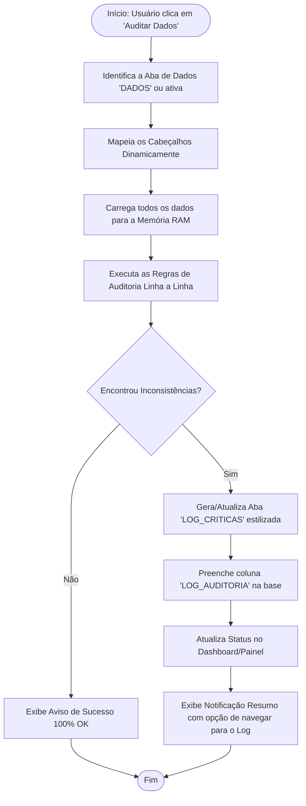

# Manual Explicativo: Módulo de Auditoria e Geração de Log (`modAuditoriaLog.bas`)

> **Finalidade do Documento:** Explicar de forma clara, acessível e completa o funcionamento do módulo VBA `modAuditoriaLog.bas`, detalhando o que ele faz, quais erros ele identifica, como os relatórios são gerados e como utilizá-lo no dia a dia da medição de contratos.

---

## 1. Visão Geral e Objetivo

No processo de medição de serviços da Petrobras, os dados operacionais (solicitações, ordens de serviço, datas de execução, quantidades atendidas e localidades) precisam estar rigorosamente consistentes para garantir:
1. **Faturamento correto:** evitar que serviços com erros de preenchimento sejam enviados para faturamento.
2. **Conformidade de SLA:** assegurar que os prazos e regras contratuais foram calculados sobre dados válidos.
3. **Agilidade na conferência:** poupar horas de conferência manual por parte dos gestores e fiscais de contrato.

O módulo **`modAuditoriaLog.bas`** é o "motor fiscalizador" automático da planilha. Ele analisa linha por linha da base de dados, identifica qualquer anomalia ou campo faltante e entrega um **diagnóstico visual completo** e estruturado.

---

## 2. Como Funciona o Processo (Fluxo de Execução)

O diagrama abaixo ilustra o ciclo de vida de uma auditoria:



---

## 3. Mapeamento Inteligente de Colunas (Sem Posições Fixas)

Um dos maiores diferenciais deste módulo é que **ele não depende de colunas fixas**. 

> **Por que isso é importante?**  
> Em planilhas antigas, se alguém inserisse uma coluna no meio, a macro que lia a "Coluna C" quebrava ou lia o dado errado. O `modAuditoriaLog` busca as colunas pelo **nome do cabeçalho**, de forma tolerante a:
> - Variações de maiúsculas/minúsculas (`Contrato` ou `CONTRATO`).
> - Acentos e espaços extras.
> - Quebras de linha internas nas células (`_x000a_`).
> - Nomes alternativos comuns entre lotes contratuais.

### Tabela de Colunas Monitoradas

| Campo no Negócio | Nomes Reconhecidos Automaticamente |
| :--- | :--- |
| **Contrato** | `Contrato`, `Contrato.1`, `Empresa` |
| **Atividade** | `Descricao da atividade`, `Atividade` |
| **Item PPU** | `Item`, `Item PPU` |
| **Aplicação** | `Aplicacao` |
| **Código Solicitação** | `Codigo da solicitacao`, `Codigo da_x000a_solicitacao` |
| **Chave Solicitante** | `Chave solicitante`, `Chave_x000a_solicitante`, `Chave` |
| **Gerência Solicitante** | `Gerencia solicitante` |
| **Data Solicitação** | `Data solicitacao`, `D. solicitacao` |
| **Qtd. Solicitada** | `Qtd. Solicitada`, `Qtd Solicitada`, `Qtd._x000a_Solicitada` |
| **Código OS** | `Codigo OS`, `OS` |
| **Data Abertura** | `D. abertura`, `Data abertura`, `Data Abertura` |
| **Data Fechamento** | `D. fechamento`, `Data fechamento`, `Data Fechamento` |
| **Prazo Combinado** | `Prazo combinado`, `Prazo_x000a_combinado` |
| **Qtd. Atendida** | `Qtd. Atendida`, `Qtd Atendida`, `Qtd._x000a_Atendida` |
| **Localidade** | `Localidade`, `Localidade - Origem`, `Centro` |
| **Município** | `Municipio`, `Municipio - Origem` |
| **UF** | `UF`, `UF - Origem` |
| **Log SLA (Power Query)** | `LOG SLA`, `LOG`, `Log` |
| **Coluna Destino de Log** | `LOG_AUDITORIA` |

---

## 4. Classificação de Severidade dos Problemas

Para que a equipe saiba exatamente o que priorizar, cada ocorrência é rotulada com um nível de gravidade:

* **CRÍTICO (Vermelho):** Inconsistências graves que invalidam a medição, impedem o cálculo de SLA ou representam violação contratual direta (ex.: datas invertidas, quantidades zeradas/negativas, campos mandatórios vazios).
* **ALERTA (Amarelo/Âmbar):** Divergências operacionais, avisos cadastrais ou formatações incomuns que requerem atenção do fiscal, mas não necessariamente travam todo o registro (ex.: caracteres especiais, divergência de volume solicitada vs atendida).

---

## 5. Regras de Negócio e Validações Realizadas

Abaixo está o detalhamento de cada uma das verificações que o módulo executa linha por linha:

### 1. Campos Obrigatórios Vazios (CRÍTICO / ALERTA)
Garante que as informações estruturais básicas existam:
* **Contrato:** Não pode estar em branco (**CRÍTICO**).
* **Descrição da Atividade:** Obrigatória para saber o serviço prestado (**CRÍTICO**).
* **Item:** Item da tabela de preços/PPU obrigatório (**CRÍTICO**).
* **Código da Solicitação:** Identificador do chamado mandatório (**CRÍTICO**).
* **Código OS:** Identificador da Ordem de Serviço (**ALERTA** se vazio em registro concluído).

### 2. Validação da Chave Solicitante (ALERTA)
* **Regra:** Verifica se a chave cadastrada possui exatamente 4 caracteres (padrão corporativo dos solicitantes).
* **Motivo:** Evita erros de digitação de chaves incompletas ou concatenadas incorretamente.

### 3. Caracteres Especiais na Gerência Solicitante (ALERTA)
* **Regra:** Detecta a presença de caracteres como barra invertida (`\`) ou sublinhado (`_`).
* **Motivo:** Esses caracteres costumam quebrar rotinas de filtros, fórmulas de texto e integração com bancos de dados legados.

### 4. Cronologia e Consistência de Datas (CRÍTICO)
* **Preenchimento e Formato:** Checa se a Data de Abertura e a Data de Fechamento estão preenchidas e se são datas válidas.
* **Cronologia Invertida (Grave):** Avalia se a **Data de Fechamento é anterior à Data de Abertura** (`Data Fechamento < Data Abertura`). Se for, aponta erro crítico, pois uma atividade não pode ser finalizada antes de ter sido aberta.

### 5. Validação de Quantidades e Desvio Volumétrico (CRÍTICO / ALERTA)
* **Qtd. Solicitada Vazia ou Não Numérica:** Aponta erro **CRÍTICO**.
* **Qtd. Solicitada Menor ou Igual a Zero:** Aponta erro **CRÍTICO** (não existe solicitação de 0 ou valor negativo).
* **Qtd. Atendida Vazia ou Não Numérica:** Aponta erro **CRÍTICO**.
* **Qtd. Atendida Negativa:** Aponta erro **CRÍTICO**.
* **Desvio Volumétrico (`Qtd Atendida > Qtd Solicitada`):** Aponta **ALERTA** informando que foi entregue um volume superior ao que foi solicitado.

### 6. Repasse de Pendências do Power Query / LOG SLA (ALERTA)
* **Regra:** Lê a coluna `LOG SLA` gerada pelo motor Power Query (linguagem M). Se a consulta M detectou feriados ausentes, prazo não cadastrado ou centro indefinido, esse apontamento é incorporado ao relatório consolidado de auditoria.

> [!NOTE]
> **Sobre a Duplicidade de Registros:**  
> A verificação de duplicidade de chaves (`Atividade # Solicitação # OS`) que existia em versões anteriores foi **deliberadamente removida da rotina de log**, permitindo que múltiplos registros com a mesma chave sejam processados normalmente sem gerar avisos de duplicidade no relatório.

---

## 6. Resultados Gerados pela Auditoria

Quando o usuário executa a auditoria, o sistema produz saídas coordenadas em 4 pontos da planilha:

### A. Criação da Aba `LOG_CRITICAS` (Relatório Executivo)
Se não existir, a aba é criada automaticamente; se já existir, ela é limpa e atualizada:
1. **Cabeçalho Executivo:** Título padronizado nas cores corporativas (Azul Petróleo Escuro), com data, hora e nome da base auditada.
2. **Tabela Estruturada de Inconsistências:** Contém 9 colunas detalhadas:
   - `Linha Base`: Número exato da linha na aba de dados (para ir direto ao problema).
   - `Contrato`: Número do contrato.
   - `Codigo OS`: Número da OS.
   - `Cod. Solicitacao`: Código da solicitação.
   - `Atividade`: Descrição do serviço.
   - `Item`: Item correspondente.
   - `Severidade`: `CRITICO` ou `ALERTA`.
   - `Regra / Campo`: Categoria da validação disparada.
   - `Descricao Detalhada da Inconsistencia`: Explicação textual do erro.
3. **Estilização Visual:**
   - Destaque em **Vermelho Suave** para itens Críticos.
   - Destaque em **Amarelo Âmbar** para Alertas.
   - Linhas com efeito zebra para facilitar a leitura.
   - Filtros automáticos ativos (`AutoFilter`).
   - Painéis congelados no cabeçalho para navegação confortável.

### B. Preenchimento da Coluna `LOG_AUDITORIA` na Própria Base
Se a aba auditada possuir uma coluna chamada `LOG_AUDITORIA`, o módulo grava o resumo dos erros diretamente nela (ex.: `Contrato vazio; Fechamento anterior a abertura`), permitindo filtrar os problemas na própria tabela de trabalho.

### C. Atualização no Painel Operacional (`Painel`)
Atualiza a célula `B14` da aba `Painel` com o status consolidado:
* Se não houver pendências: `[OK] Auditoria (DD/MM HH:MM) - Sem Pendencias` (em verde).
* Se houver pendências: `[ALERTA] Auditoria: X Criticos / Y Alertas (DD/MM HH:MM)` (em vermelho ou âmbar).

### D. Notificação Interativa para o Usuário (`MsgBox`)
Ao término da execução:
* **Sem erros:** Uma caixa de diálogo parabeniza o usuário informando que a base está em conformidade total.
* **Com erros:** Informa a quantidade exata de erros críticos e alertas, e pergunta:  
  * *"Deseja navegar para a aba 'LOG_CRITICAS' para conferir os detalhes?"*  
  Se o usuário clicar em **Sim**, o Excel já ativa diretamente a aba do relatório.

---

## 7. Como Utilizar as Macros no Dia a Dia

O módulo oferece 3 rotinas públicas que podem ser associadas a botões no Excel ou acionadas via menu de macros (**Alt + F8**):

```
┌────────────────────────────────────────────────────────────────────────┐
│                        ROTINAS PÚBLICAS DISPONÍVEIS                    │
├──────────────────────────┬─────────────────────────────────────────────┤
│ Macro                    │ O que ela faz                               │
├──────────────────────────┼─────────────────────────────────────────────┤
│ AuditarDadosEGerarLog    │ Audita a base principal consolidada         │
│                          │ ('DADOS', 'Painel_T2M' ou 'DADOS_IRON-LT1') │
├──────────────────────────┼─────────────────────────────────────────────┤
│ AuditarAbaAtiva          │ Audita a aba que estiver aberta na tela     │
│                          │ (ex: abas específicas de lotes/regionais)   │
├──────────────────────────┼─────────────────────────────────────────────┤
│ LimparRelatorioLog       │ Limpa a aba 'LOG_CRITICAS' para iniciar uma │
│                          │ nova conferência limpa                      │
└──────────────────────────┴─────────────────────────────────────────────┘
```

---

## 8. Arquitetura Técnica e Desempenho

Para desenvolvedores e técnicos de BI que precisem manter o código:

1. **Processamento 100% em Memória (Variant Arrays):**
   Em vez de ler e escrever célula a célula (`Cells(i, j)`), a rotina despeja a tabela inteira para uma matriz em memória RAM, executa as verificações e grava os resultados em bloco. Isso reduz o tempo de auditoria de dezenas de segundos para milissegundos.
2. **Otimização de Ambiente:**
   Desativa `Application.ScreenUpdating`, `Application.EnableEvents` e coloca o cálculo em manual (`xlCalculationManual`) durante a execução, restaurando o estado original no encerramento.
3. **Tratamento Defensivo de Erros:**
   Possui bloco `On Error GoTo TratarErro` garantindo que, mesmo diante de falhas imprevistas de dados, os recursos do Excel serão religados corretamente sem congelar a tela do usuário.
4. **Independência de Bibliotecas Externas:**
   Utiliza funções nativas do VBA sem dependência de DLLs de terceiros, garantindo compatibilidade total com Excel 32-bit e 64-bit.
