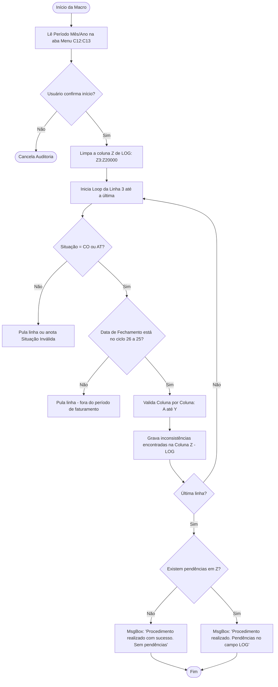
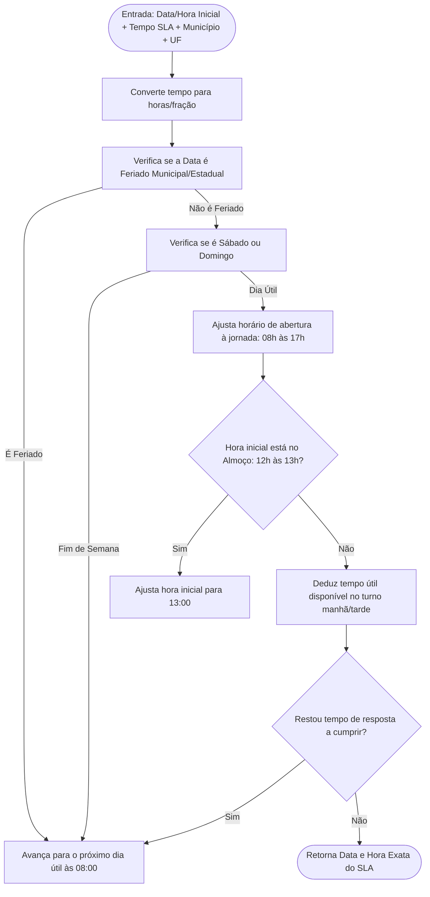

# Análise Técnica e Funcional das Macros: `Monitoramento individual_A4UU_v3.0.xlsm`

> **Finalidade do Documento:** Fornecer uma explicação completa, estruturada e acessível de todas as rotinas, regras de negócio e macros VBA contidas no arquivo **`Monitoramento individual_A4UU_v3.0.xlsm`**, demonstrando o que cada módulo faz, como as informações são validadas e como ele se conecta ao ecossistema de medição contratual da Petrobras.

---

## 1. Visão Geral e Contexto da Planilha

O arquivo `Monitoramento individual_A4UU_v3.0.xlsm` é uma ferramenta operacional desenvolvida originalmente por **Thiago Lima de Paiva (XMED)**. Sua função principal é servir de planilha individual para acompanhamento, validação e consolidação de chamados, solicitações e Ordens de Serviço (OS) vinculados a um usuário ou frente operacional específica (neste caso, com a chave/lote `A4UU`).

### Principais Objetivos da Planilha:
1. **Auditar os dados digitados:** impedir que registros com dados incorretos, campos em branco ou fora do padrão contratual avancem para a medição.
2. **Calcular o SLA real:** determinar a data/hora limite de atendimento respeitando a jornada de trabalho (8h às 17h), horário de almoço (12h às 13h), fins de semana e feriados locais.
3. **Consolidar múltiplos arquivos:** agrupar vários arquivos de monitoramento espalhados em uma pasta em uma única base de dados.
4. **Controlar o ciclo mensal da Petrobras:** trabalhar estritamente com a janela de corte de medição contratual (do **dia 26 do mês anterior ao dia 25 do mês corrente**).

---

## 2. Estrutura de Abas e Módulos VBA

A pasta de trabalho é composta por 8 abas e 5 módulos de código VBA ativos:

```
┌────────────────────────────────────────────────────────────────────────────────────────┐
│                        MAPA DE ABAS E MÓDULOS VBA CORRESPONDENTES                      │
├─────────────────────┬──────────────────────┬───────────────────────────────────────────┤
│ Aba no Excel        │ Módulo VBA           │ Papel no Sistema                          │
├─────────────────────┼──────────────────────┼───────────────────────────────────────────┤
│ Monitoramento       │ Planilha1 (Classe)   │ Base operacional dos registros de OS e    │
│                     │                      │ rotina principal de auditoria de linha    │
├─────────────────────┼──────────────────────┼───────────────────────────────────────────┤
│ Menu                │ Planilha3 (Classe)   │ Painel de parâmetros (mês/ano) e macro    │
│                     │                      │ de consolidação de múltiplos arquivos     │
├─────────────────────┼──────────────────────┼───────────────────────────────────────────┤
│ TabelaA             │ Planilha2 (Classe)   │ Tabelas auxiliares de validação (itens,   │
│                     │                      │ atividades, contratos, UFs, centros)      │
├─────────────────────┼──────────────────────┼───────────────────────────────────────────┤
│ TabelaB             │ Planilha5 (Classe)   │ Base espelho importada com calendários,   │
│                     │                      │ feriados municipais e vínculos de centro  │
├─────────────────────┼──────────────────────┼───────────────────────────────────────────┤
│ -                   │ aFuncoes (Módulo)    │ Motor de cálculo de SLA, catálogo de msgs │
│                     │                      │ de erro e validações de regras de negócio │
├─────────────────────┼──────────────────────┼───────────────────────────────────────────┤
│ -                   │ bFuncoes (Módulo)    │ Mecanismo de busca dinâmica (.Find) para  │
│                     │                      │ pesquisa de centros, UFs e feriados       │
└─────────────────────┴──────────────────────┴───────────────────────────────────────────┘
```

---

## 3. Análise Detalhada dos Módulos e Macros

---

### 3.1. `Planilha1` (Aba `Monitoramento`)

Contém as duas macros de maior impacto operacional direto:

#### A) `Sub analiseMonitoramento()` — Motor de Auditoria Linha a Linha
Esta macro é o coração da planilha. Ela varre todos os registros da linha 3 até a última linha preenchida (`ul`) e valida cada coluna individualmente.



##### Passo a Passo da Rotina:
1. **Confirmação do Período:** Lê as células `C12` (Mês) e `C13` (Ano) da aba `Menu`. Calcula o mês anterior (`iPerAnt`). Se for janeiro (1), o mês anterior vira dezembro (12).
2. **Filtro de Situação:** Só processa registros cuja coluna C seja **`CO`** (Concluído) ou **`AT`** (Atendido). Se estiver preenchido com outra sigla não cadastrada na `TabelaA`, acusa `"Descrição inválida"`.
3. **Filtro da Janela de Faturamento (26 a 25):** 
   - A data de fechamento (coluna B) deve estar entre o **dia 26 do mês anterior** e o **dia 25 do mês vigente**.
   - Se a data estiver fora deste intervalo, a linha é ignorada (não é faturada nesta medição).
4. **Limpeza e Registro de Log:** Limpa previamente a coluna `Z` (`Z3:Z20000`). Cada erro encontrado na linha é concatenado na coluna `Z` com a identificação da coluna correspondente (ex: `(Coluna F e G): Campo item não pertence ao campo atividade; `).

---

#### B) `Sub faturamentoPorPeriodo()` — Contabilizador de Solicitações
* **Objetivo:** Calcular quantas solicitações foram efetivamente concluídas dentro da janela de medição.
* **Funcionamento:** Percorre a coluna B (Data de Fechamento) e testa a mesma regra cronológica (dia 26 do mês anterior até o dia 25 do mês vigente). Ao final, emite uma mensagem com o total contabilizado:  
  *Exemplo:* `"Segue quantidade contabilizada: 482"`.

---

### 3.2. `Planilha3` (Aba `Menu`)

#### `Sub agrupamento_arquivo_monitoramento()` — Consolidador de Arquivos
Esta macro resolve o problema de ter dezenas de fiscais/analistas preenchendo planilhas individuais separadas:

1. **Seleção de Pasta via `InputBox`:** Pede ao usuário o caminho de uma pasta no computador ou rede onde estão os arquivos de monitoramento (`.xlsm` / `.xlsx`).
2. **Validação do Diretório:** Checa se o caminho existe via `Dir(sDir, vbDirectory)`.
3. **Limpeza da Base Atual:** Limpa a área de dados da aba `Monitoramento` (`A3:AL50000`).
4. **Varredura Automatizada:**
   - Utiliza `Scripting.FileSystemObject` para iterar por todos os arquivos da pasta.
   - Ignora arquivos temporários abertos que começam com `~$`.
   - Abre cada pasta de trabalho silenciosamente em segundo plano com `Application.EnableEvents = False`.
   - Remove filtros existentes na primeira aba (`wsPlan.AutoFilter.ShowAllData`).
   - Identifica a última linha com dados pela coluna I.
   - Copia o bloco `A3:AL[ultimaLinha]`.
   - Cola como **Valores** (`xlPasteValues`) na aba `Monitoramento` da planilha mestre, uma embaixo da outra sequencialmente.
   - Fecha o arquivo de origem sem salvar alterações (`wbArq.Close False`).
5. **Finalização:** Restaura os eventos e emite aviso de conclusão.

---

### 3.3. `Planilha5` (Aba `TabelaB`)

#### `Sub btImportacaoTabelaB()` — Atualizador de Base de Tabelas Externas
* **Objetivo:** Manter a planilha atualizada com os parâmetros corporativos (tabelas de centros, calendários de feriados municipais, UFs e referências).
* **Funcionamento:**
  1. Lê o caminho completo do arquivo externo informado na célula `C27` da aba `Menu`.
  2. Abre o arquivo externo (`wbTabelaB`).
  3. Varre todas as abas do arquivo externo e copia cada coluna preenchida para a aba `TabelaB`.
  4. **Criação de Cabeçalho Composto:** Concatena o nome da aba original com o título da coluna (ex.: `Centro#Município`, `Calendario#Data`, `Localidade#Centro`) na primeira linha e exclui a segunda linha.
  5. Ajusta automaticamente a largura das colunas e grava a data/hora da atualização na célula `G16` da aba `Menu`.

---

### 3.4. `aFuncoes.bas` — Regras de Negócio e Cálculo Avançado de SLA

Este módulo reúne as funções que dão suporte à inteligência da planilha:

#### 1. `preencher_usuario_rede()`
* Captura o login Windows do operador atual usando o objeto de sistema `WScript.Network` (`objNetwork.UserName`) e grava em maiúsculas na Coluna A.

#### 2. `ExibirMsg(Msg)` — Dicionário de Mensagens
Centraliza o texto das inconsistências apontadas no campo LOG:
* `dataInvalida`: "Data inválida"
* `descrInvalida`: "Descrição inválida para a coluna informada"
* `campoVazio`: "Campo vazio. Preenchimento obrigatório"
* `campoVazioMed`: "Campo vazio e situação concluída"
* `caractInvalido`: "Caractere inválido para texto inserido: "
* `itemXAtividade`: "Campo item não pertence ao campo atividade"
* `contratoXuf`: "Campo contrato não pertence ao campo UF"
* `atividadeSemPrazo`: "Prazo obrigatório para atividade informada"
* `infNaoEncontrada`: "Informação não encontrada. Informe o responsável (ADM ou DEV)"
* `ativarLocalidade`: "Localidade não ativa. Informe o responsável"
* `limiteDesr`: "Permitido apenas \<SIM\> ou \<NÃO\>"

#### 3. `validar_itemDescricao(sAtividade, sItem)`
* Faz busca cruzada na `TabelaA` (linhas das colunas 19 e 20) para certificar se o Item PPU realmente pode ser cobrado para aquela Atividade específica.

#### 4. `validar_contratoUF(sContrato, sUF)`
* Garante que o número de contrato selecionado tem cobertura para o Estado (UF) em questão (conferência na `TabelaA` colunas 30 e 31).

#### 5. `verificar_localidadeAtiva(sLocalidade)`
* Checa na `TabelaA` se a localidade/imóvel possui centro operacional ativo cadastrado (`"N"` acusa localidade inativa).

#### 6. `calcular_dataSLA(...)` — O Motor de Prazos Úteis
Calcula a data e hora exata em que o SLA deve expirar:



* **Horário de Expediente:** Segunda a Sexta das **08:00 às 17:00** (8 horas úteis diárias).
* **Intervalo de Almoço:** **12:00 às 13:00** (tempo suspenso, não conta no SLA).
* **Finais de Semana:** Sábados e Domingos são sumariamente ignorados.
* **Feriados Municipais/Estaduais:** Consulta a função `pesquisar_EFeriado` para saber se a cidade da prestação estava de folga oficial.

---

### 3.5. `bFuncoes.bas` — Mecanismo de Busca Dinâmica na TabelaB

Como a aba `TabelaB` possui cabeçalhos concatenados (`Aba#Coluna`), este módulo utiliza o método nativo `.Find` do Excel para localizar onde cada coluna está em tempo de execução:

1. **`pesquisar_centro(sLocalidade)`:** Localiza a coluna `Localidade#Localidade` e a coluna `Localidade#Centro`, buscando a qual Centro de Custo a localidade pertence.
2. **`pesquisar_municipioUF(sCentro)`:** A partir do Centro encontrado, localiza o Município e a UF correspondente no formato `Município|UF`.
3. **`pesquisar_EFeriado(dDataInicial, sMunicipio, sUF)`:** Busca na tabela `Calendario` se aquela data é feriado cadastrado para aquele município e UF específicos.
4. **`validar_municipioCalend(sMunicipio)`:** Valida se o município está devidamente coberto pelo calendário de feriados.

---

## 4. Matriz Completa de Validação por Coluna (Aba `Monitoramento`)

A tabela abaixo resume exatamente o que a macro `analiseMonitoramento` exige de cada coluna:

| Coluna | Campo Monitorado | Regra / Validação Aplicada | Severidade do Erro |
| :---: | :--- | :--- | :--- |
| **A** | Usuário | Se vazio, preenche automaticamente com o usuário Windows da rede | Automático |
| **B** | Data de Fechamento | Obrigatória; formato de data válido; deve estar entre dia 26 e dia 25 | Crítico (pula linha) |
| **C** | Situação | Obrigatória; apenas `"CO"` (Concluído) ou `"AT"` (Atendido) | Crítico (pula linha) |
| **D** | Contrato | Obrigatório; deve existir na lista da TabelaA (Coluna E) | Inconsistência (Log) |
| **E** | UF | Obrigatório; deve existir na lista da TabelaA (Coluna AD); valida Contrato x UF | Inconsistência (Log) |
| **F** | Item | Obrigatório; deve existir na TabelaA (Coluna K) | Inconsistência (Log) |
| **G** | Descrição da Atividade | Obrigatório; valida se o Item pertence a esta Atividade específica | Inconsistência (Log) |
| **H** | Aplicação | Obrigatório; deve constar na TabelaA (Coluna AH) | Inconsistência (Log) |
| **I** | Código Solicitação | Obrigatório; proíbe espaços em branco no código | Inconsistência (Log) |
| **J** | Chave Solicitante | Obrigatório; proíbe espaços em branco | Inconsistência (Log) |
| **K** | Gerência Solicitante | Obrigatório; não pode estar vazio | Inconsistência (Log) |
| **L** | Data de Abertura | Obrigatório; data válida; base para cálculo do SLA | Inconsistência (Log) |
| **M** | Data do SLA | Se vazio, calcula SLA útil (8h-17h, almoço, feriados). Se preenchido, valida se é data | Cálculo ou Log |
| **N** | Código da OS | Obrigatório; proíbe espaços, barras invertidas (`\`) e sublinhados (`_`) | Inconsistência (Log) |
| **O** | Prazo Combinado | Obrigatório; valor não pode ser vazio nem zero | Inconsistência (Log) |
| **P** | Item PPU | Obrigatório; proíbe espaços | Inconsistência (Log) |
| **Q** | Data da Solicitação | Obrigatório; formato de data válido | Inconsistência (Log) |
| **R** | Data de Fechamento | Obrigatório; formato de data válido | Inconsistência (Log) |
| **S** | Prazo Combinado Fisc. | Obrigatório apenas se a atividade for classificada como `"Fiscalização"` | Inconsistência (Log) |
| **T** | Quantidade Solicitada | Obrigatório; valor deve ser numérico e maior que zero | Inconsistência (Log) |
| **U** | Unidade | Se preenchido, deve constar na lista da TabelaA (Coluna Y) | Inconsistência (Log) |
| **V** | Localidade | Obrigatório; deve constar na TabelaA (Coluna AK) e com centro ativo (`"S"`) | Inconsistência (Log) |
| **W a X** | Observações / Livre | Campos livres para anotações operacionais | Livre |
| **Y** | Limite Desvio | Deve ser exclusivamente `"SIM"` ou `"NÃO"` | Inconsistência (Log) |
| **Z** | **LOG (Saída)** | **Coluna de resultado da auditoria: armazena todos os erros da linha** | **Saída do Sistema** |

---

## 5. Relação com o Novo Painel e Modernizações Recentes

A análise das macros do `Monitoramento individual_A4UU_v3.0.xlsm` permite entender com precisão a evolução do projeto:

1. **Origem das Regras do `modAuditoriaLog.bas`:**  
   As regras de datas, chave solicitante, caracteres proibidos na gerência (`_`, `\`), desvios e campos obrigatórios que hoje estão modernizados em [modAuditoriaLog.bas](file:///d:/PainelNovo/Codes/VBA/Funções%20Novas/modAuditoriaLog.bas) foram herdadas diretamente da lógica deste arquivo de monitoramento.
2. **De Colunas Fixas para Mapeamento Dinâmico:**  
   Enquanto o monitoramento individual dependia rigidamente de posições como `Cells(i, 3)` ou `Cells(i, 26)`, o novo painel busca os campos pelos nomes de cabeçalho (`Contrato`, `OS`, `Data abertura`), permitindo que a ordem das colunas mude sem quebrar o código.
3. **Migração do Cálculo de SLA para o Power Query M:**  
   O loop de cálculo de SLA que aqui consumia tempo considerável linha a linha no VBA (`calcular_dataSLA`) foi refatorado no novo painel para funções M do Power Query (`fnCalcularDataSLA.m`, `fnCalcularPrazoSLA.m`), tornando o recálculo massivo instantâneo.
4. **Duplicidade de Registro:**  
   Conforme a diretriz recente alinhada para a medição consolidada, a validação de duplicidade de chaves foi desativada no motor de log moderno, enquanto nesta planilha legada a preocupação era estritamente a conformidade cadastral de cada linha individualmente.
