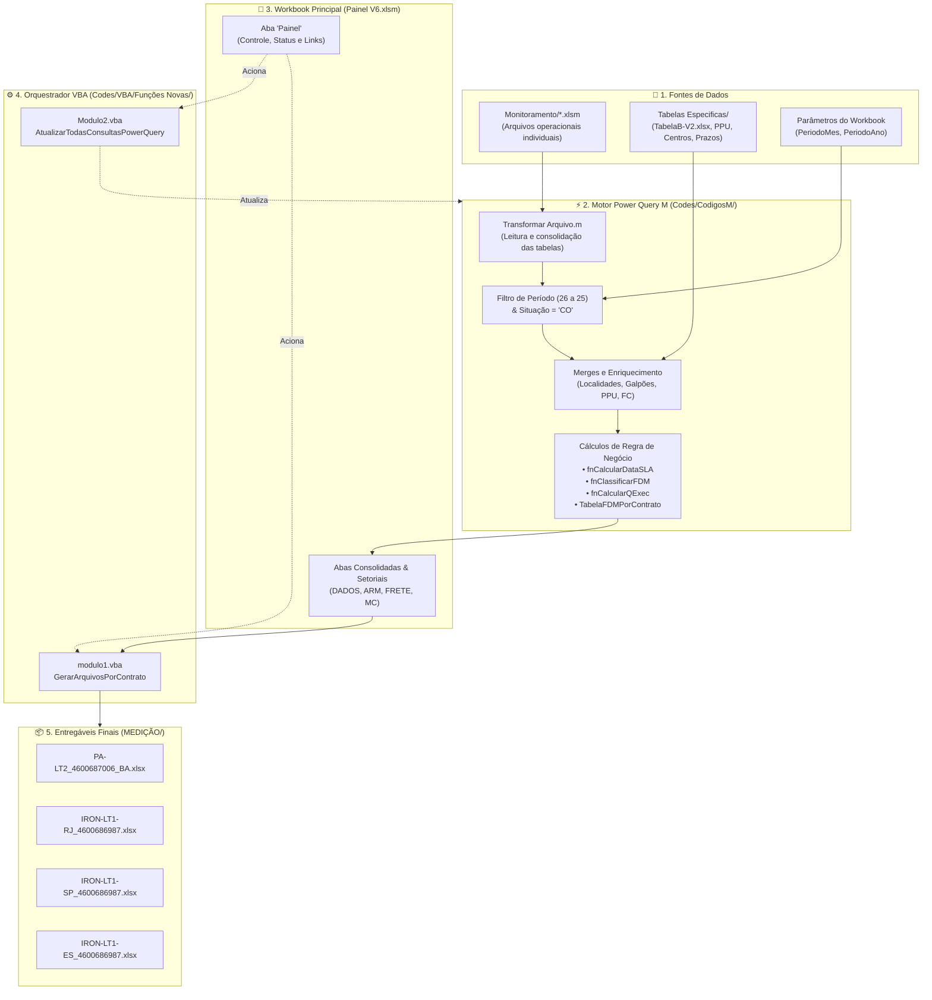

# 📊 Painel de Controle - Memória de Cálculo e Medição Contratual

[](https://www.microsoft.com/excel)
[](https://learn.microsoft.com/power-query/)
[-004880?style=for-the-badge&logo=visual-basic&logoColor=white)](https://learn.microsoft.com/office/vba/api/overview/excel)
[](https://github.com/)

> Solução analítica e operacional em Excel, Power Query (M) e VBA para consolidação de atendimentos operacionais, apuração de SLA/prazos, cálculo de FDM (Fator de Desempenho Mensal), quantificação padronizada (QExec), controle de frete/armazenagem e geração automatizada de relatórios de Memória de Cálculo (MC) para contratos de serviços corporativos Petrobras.

---

## 📌 Sumário

- [Visão Geral](#-visão-geral)
- [Contratos Atendidos](#-contratos-atendidos)
- [Arquitetura da Solução](#-arquitetura-da-solução)
- [Principais Regras de Negócio](#-principais-regras-de-negócio)
- [Estrutura do Repositório](#-estrutura-do-repositório)
- [Fluxo Operacional (Como Usar)](#-fluxo-operacional-como-usar)
- [Arquivos de Saída](#-arquivos-de-saída)
- [Requisitos do Ambiente](#-requisitos-do-ambiente)
- [Boas Práticas e Recomendações](#-boas-práticas-e-recomendações)
- [Documentações Complementares](#-documentações-complementares)

---

## 🎯 Visão Geral

O faturamento e a medição de serviços operacionais exigem a conciliação de centenas a milhares de ordens de serviço distribuídas entre múltiplos polos e prestadores. O **Painel de Controle MemoriaPetrobras V6** automatiza a esteira de ponta a ponta:

1. **Ingestão Automatizada:** Varre os arquivos individuais de monitoramento operacional das unidades.
2. **Transformação & Enriquecimento (ETL):** Padroniza dados textuais, cruza tabelas de referência técnica (Tabela B, PPU, Centros, Galpões, UF, Origem/Destino) e filtra registros elegíveis.
3. **Motor de Cálculo:** Executa apurações estritas de datas limite de atendimento (SLA), conformidade de prazos, indexadores de qualidade (FDM), fatores de conversão de volume executado (QExec) e tarifas de frete/armazenagem.
4. **Geração Automatizada:** Produz cadernos individuais em formato `.xlsx` limpo para cada contrato/região, contendo as 4 abas contratuais padronizadas (`MC`, `ARM`, `DADOS`, `FRETE`).

---

## 🏢 Contratos Atendidos

| Lote / Identificador | Região | Número Contrato (SAP) | Prestadora / Escopo |
| :--- | :--- | :--- | :--- |
| **`PA-LT2`** | Bahia (BA) | `4600687006` | Atendimento Lote 2 |
| **`IRON-LT1-RJ`** | Rio de Janeiro (RJ) | `4600686987` | Atendimento Lote 1 - Região RJ |
| **`IRON-LT1-SP`** | São Paulo (SP) | `4600686987` | Atendimento Lote 1 - Região SP |
| **`IRON-LT1-ES`** | Espírito Santo (ES) | `4600686987` | Atendimento Lote 1 - Região ES |

---

## 🏗 Arquitetura da Solução

O projeto adota uma **arquitetura híbrida**, combinando a alta velocidade de processamento relacional do **Power Query M** para carga e cálculos com a flexibilidade do **VBA** para orquestração e exportação de pastas de trabalho.



---

## ⚖️ Principais Regras de Negócio

### 1. Janela de Faturamento (Período Operacional)
- O faturamento contratual **não coincide** com o mês civil.
- A função `fnGerarPeriodo.m` delimita o ciclo de apuração:
  - **Início:** Dia **26** do mês anterior.
  - **Término:** Dia **25** do mês de referência.
  - *Exemplo (Mês Agosto/2026):* `26/07/2026` a `25/08/2026`.

### 2. Filtro de Elegibilidade
- Apenas atendimentos com status **`Situação = "CO"`** (Concluído) e com data de faturamento válida são considerados na medição oficial.

### 3. Motor de SLA e Prazos Contratuais (`fnCalcularDataSLA.m`)
- **Horário Comercial:** Expediente útil das **08:00 às 17:00**.
- **Intervalo Intrajornada:** Pausa de almoço das **12:00 às 13:00** (não contabilizada no prazo).
- **Dias Úteis:** Contagem de segunda a sexta-feira, transpondo automaticamente feriados e fins de semana.
- **Tipos de Prazo:** 0, 0,5, 1, 2, 3, 4 e 5 dias úteis de acordo com o item e criticidade da solicitação.

### 4. Fator de Desempenho Mensal (FDM)
- Unicidade garantida por chave composta: `Descrição da atividade` + `Código da solicitação` + `Código OS`.
- Classificação analítica em: `Normal`, `Expresso`, `Isento` ou `FDM definido`.
- Apuração mensal dos índices de cumprimento `TSPE1`/`TSPR1`, `TSPE2`/`TSPR2` e `IAPFARQ`.

### 5. Quantidade Executada Padronizada (QExec)
Conversão matemática de itens heterogêneos para unidades contratuais padronizadas:
- **Embalagens:** Fator `0,1`
- **Item Avulso:** Fator `0,017`
- **Organização Analítica:** Fator `1,0`
- **Organização Simples:** Fator `0,5`
- **Digitalização e Migração:** Fatores específicos mapeados nas tabelas de conversão (`tabela_FC_*`).

---

## 📁 Estrutura do Repositório

```text
PainelNovo/
│
├── Painel de controle MemoriaPetrobras V6.xlsm   # Pasta de trabalho principal (Macros + Conexões)
├── Processamento Medicoes logs.xlsx             # Log histórico de execuções e processamentos
├── DOCUMENTACAO_PROJETO.md                      # Mapeamento técnico exaustivo das rotinas
├── APONTAMENTOS_E_MELHORIAS.md                  # Análise estática, diagnóstico e plano de melhorias
├── dashboard_painel_excel.html                  # Protótipo de dashboard executivo responsivo
│
├── Monitoramento/                               # Pastas de entrada com planilhas individuais
│   ├── Monitoramento individual_A4UU_v3.0.xlsm
│   ├── Monitoramento individual_DPBR_v3.0.xlsm
│   └── ...
│
├── Tabelas Especificas/                         # Tabelas dimensionais e de parametrização
│   ├── TabelaB-V2.xlsx                          # De-Para de PPU, Prazos, SLA, Centros e Galpões
│   └── ...
│
├── Medição - Contratada/                        # Bases consolidadas por contrato
│   ├── IRON/                                    # Arquivos base Lote 1
│   └── PA/                                      # Arquivos base Lote 2
│
├── MEDIÇÃO/                                     # Repositório de saída dos relatórios gerados
│   ├── IRON-LT1-RJ_4600686987_*.xlsx
│   ├── IRON-LT1-SP_4600686987_*.xlsx
│   ├── IRON-LT1-ES_4600686987_*.xlsx
│   └── PA-LT2_4600687006_BA_*.xlsx
│
└── Codes/                                       # Código-fonte desacoplado para versionamento
    ├── CodigosM/                                # 83 arquivos de consultas e funções Power Query M
    │   ├── Painel T2M.m
    │   ├── fnCalcularDataSLA.m
    │   ├── fnClassificarFDM.m
    │   ├── fnCalcularQExec.m
    │   └── ...
    ├── VBA/
    │   ├── Funções Novas/                       # Módulos atuais de automação
    │   │   ├── modulo1.vba                      # GerarArquivosPorContrato
    │   │   ├── Modulo2.vba                      # AtualizarTodasConsultasPowerQuery
    │   │   └── modDashboard.bas                 # Interface do dashboard no Excel
    │   └── FuncoesAntigas/                      # Módulos históricos legados
    │       ├── Planilha7.cls
    │       ├── A_Calc_Medicao.bas
    │       ├── B_Calc_ARM.bas
    │       └── ...
    └── TXT/                                     # Backups textuais adicionais
```

---

## 🚀 Fluxo Operacional (Como Usar)

### Passo 1: Preparação das Entradas
1. Certifique-se de que os arquivos de monitoramento individual do período estejam depositados na pasta `Monitoramento/`.
2. Verifique se as tabelas de apoio em `Tabelas Especificas/TabelaB-V2.xlsx` estão atualizadas com novos itens de PPU ou alterações de galpões/prazos.

### Passo 2: Execução no Workbook
1. Abra o arquivo **`Painel de controle MemoriaPetrobras V6.xlsm`** com macros habilitadas.
2. Na aba **`Painel`**:
   - Selecione o **Mês** e o **Ano** de referência da medição.
   - O intervalo de datas de faturamento (ex: `26/MM/AAAA` a `25/MM/AAAA`) será calculado automaticamente.
3. Clique no botão **`Atualizar Consultas`**:
   - A macro `AtualizarTodasConsultasPowerQuery` processará os dados via Power Query.
   - Acompanhe a célula de status `B12` e a barra de status inferior.
4. Após o término e conferência das abas de resultado (`DADOS`, `ARM`, `FRETE`, `MC`):
   - Clique no botão **`Gerar Arquivos`** (macro `GerarArquivosPorContrato`).
   - Os arquivos de cada contrato serão gravados na pasta `MEDIÇÃO/`.
   - Os links de acesso direto aos relatórios serão gravados no painel.

---

## 📦 Arquivos de Saída

Cada arquivo gerado na pasta `MEDIÇÃO/` é um arquivo puro `.xlsx` (sem vínculos externos ou macros), estruturado nas seguintes 4 abas:

| Aba | Descrição | Conteúdo Principal |
| :--- | :--- | :--- |
| **`MC`** | Memória de Cálculo | Resumo financeiro consolidado por item, quantidades apuradas, preços unitários (PPU) e total a faturar. |
| **`ARM`** | Armazenagem | Posição física, saldos, metros cúbicos/caixas custodiadas e custos de armazenagem do período. |
| **`DADOS`** | Registros Analíticos | Base completa de atendimentos com rastreabilidade total (datas, prazos, SLA, QExec, OS, etc.). |
| **`FRETE`** | Transporte e Deslocamentos | Registro detalhado de viagens, coletas, rotas normais/expressas, quilometragem apurada e valores de frete. |

---

## 💻 Requisitos do Ambiente

- **Sistema Operacional:** Windows 10 ou superior.
- **Aplicativo:** Microsoft Excel 2019, 2021 ou **Microsoft 365 (Recomendado)**.
- **Recursos Necessários:**
  - Suporte nativo a **Power Query** (Get & Transform).
  - Permissão para execução de macros VBA (`.xlsm`).
  - Acesso de leitura/escrita na pasta raiz do projeto e subpastas de rede/disco local.

---

## 🛡️ Boas Práticas e Recomendações

Conforme diagnosticado no relatório [APONTAMENTOS_E_MELHORIAS.md](APONTAMENTOS_E_MELHORIAS.md):
- **Caminhos Dinâmicos:** Assegurar que as consultas Power Query utilizem parâmetros relativos (`Excel.CurrentWorkbook()`) para evitar quebras por caminhos absolutos de disco.
- **Restauração de Estado:** Rotinas VBA que manipulam `Application.ScreenUpdating` e `Application.EnableEvents` devem sempre capturar o estado anterior e restaurá-lo via blocos de saída garantida.
- **Limpeza de Conexões:** Manter o catálogo de conexões do Excel enxuto, expurgando conexões órfãs ou duplicadas para acelerar o tempo total de atualização.

---

## 📚 Documentações Complementares

- [DOCUMENTACAO_PROJETO.md](DOCUMENTACAO_PROJETO.md): Documento técnico detalhado com mapeamento de todas as 83 funções M, módulos VBA legados e dicionário de dados.
- [APONTAMENTOS_E_MELHORIAS.md](APONTAMENTOS_E_MELHORIAS.md): Diagnóstico aprofundado de oportunidades de otimização de performance, segurança e arquitetura.
- [dashboard_painel_excel.html](dashboard_painel_excel.html): Painel de visualização executiva em formato web.
