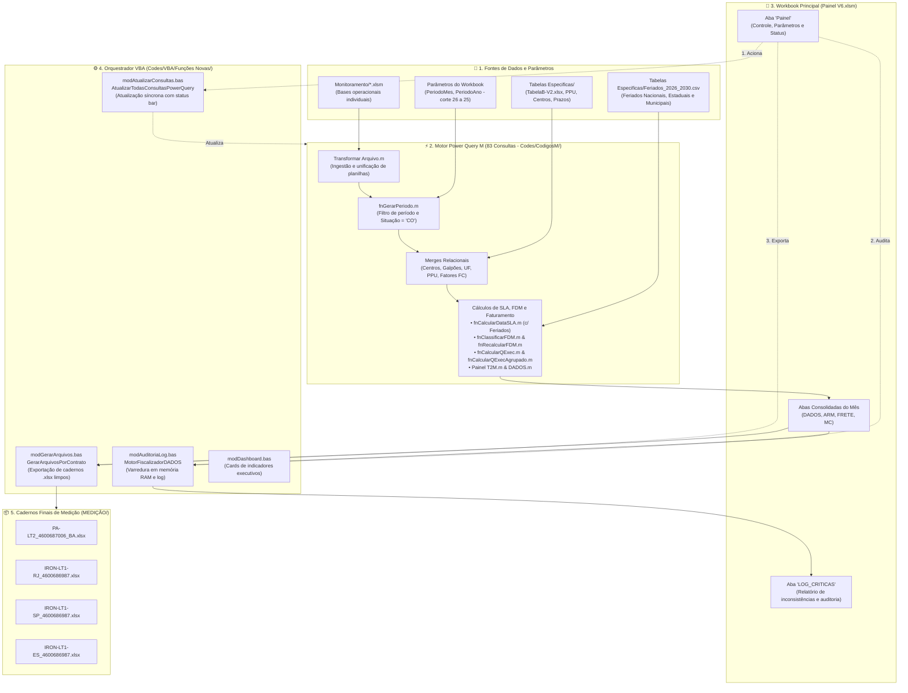

# 📊 Painel de Controle - Memória de Cálculo e Medição Contratual

[](https://www.microsoft.com/excel)
[](https://learn.microsoft.com/power-query/)
[](https://learn.microsoft.com/office/vba/api/overview/excel)
[](https://github.com/)

> Solução corporativa de engenharia de dados e automação em Excel, Power Query (Linguagem M) e VBA desenvolvida para consolidação de atendimentos operacionais, apuração estrita de SLA/prazos com suporte a feriados municipais, cálculo de FDM (Fator de Desempenho Mensal), quantificação padronizada (QExec), auditoria preventiva de integridade e geração automatizada de relatórios contratuais de Memória de Cálculo (MC) para contratos de serviços da Petrobras.

---

## 📌 Sumário

- [Visão Geral](#-visão-geral)
- [Contratos Atendidos](#-contratos-atendidos)
- [Arquitetura da Solução](#-arquitetura-da-solução)
- [Principais Regras de Negócio](#-principais-regras-de-negócio)
- [Módulo de Auditoria e Qualidade de Dados (`modAuditoriaLog`)](#-módulo-de-auditoria-e-qualidade-de-dados-modauditorialog)
- [Estrutura do Repositório](#-estrutura-do-repositório)
- [Fluxo Operacional (Como Usar)](#-fluxo-operacional-como-usar)
- [Arquivos de Saída](#-arquivos-de-saída)
- [Últimas Alterações e Melhorias Implementadas](#-últimas-alterações-e-melhorias-implementadas)
- [Documentações Técnicas e Manuais Complementares](#-documentações-técnicas-e-manuais-complementares)
- [Requisitos do Ambiente](#-requisitos-do-ambiente)

---

## 🎯 Visão Geral

O processo de medição de serviços operacionais corporativos da Petrobras exige a conciliação mensal de milhares de ordens de serviço (OS) e chamados distribuídos entre múltiplos polos de atendimento (BA, RJ, SP, ES) e prestadoras contratadas.

O **Painel de Controle MemoriaPetrobras V6** unifica e automatiza essa esteira operacional de ponta a ponta:

1. **Ingestão Descentralizada:** Lê dinamicamente os cadernos de monitoramento operacional das unidades (`Monitoramento/*.xlsm`).
2. **Transformação & Enriquecimento (ETL em Power Query M):** Padroniza dados textuais, cruza tabelas de referência técnica (`Tabela B`, `PPU`, `Centros`, `Galpões`, `Origem/Destino`, `Feriados`) e filtra apenas registros elegíveis do ciclo.
3. **Motor de Cálculo Especializado:**
   - **SLA Útil:** Determina datas limites de atendimento considerando expediente útil (08:00–17:00), intervalo intrajornada (12:00–13:00) e calendário unificado de feriados nacionais, estaduais e municipais.
   - **FDM:** Classifica indicadores de conformidade de prazo e calcula índices mensais (`TSPE`/`TSPR`, `IAPFARQ`).
   - **QExec:** Aplica fatores de conversão matemática para precificação unificada de volumes heterogêneos.
   - **Frete & Deduplicação de KM:** Calcula quilometragens adicionais e consolida custos de transporte sem cobranças duplicadas na mesma viagem.
4. **Auditoria Preventiva de Integridade:** Módulo VBA dedicado (`modAuditoriaLog.bas`) que fiscaliza a base em memória antes da exportação, gerando diagnósticos na aba `LOG_CRITICAS`.
5. **Geração Automatizada de Entregáveis:** Produz cadernos individuais limpos em formato `.xlsx` na pasta `MEDIÇÃO/`, divididos nas 4 abas contratuais oficiais (`MC`, `ARM`, `DADOS`, `FRETE`).

---

## 🏢 Contratos Atendidos

| Lote / Identificador | Região / UF | Contrato SAP | Instrumento Jurídico | Prestadora / Escopo |
| :--- | :--- | :--- | :--- | :--- |
| **`PA-LT2`** | Bahia (BA) | `4600687006` | Contrato 5900.0133214.25.2 | Serviços de Guarda e Apoio Operacional - Lote 2 |
| **`IRON-LT1-RJ`** | Rio de Janeiro (RJ) | `4600686987` | Contrato 5900.0133210.25.2 | Serviços de Guarda e Apoio Operacional - Lote 1 (RJ) |
| **`IRON-LT1-SP`** | São Paulo (SP) | `4600686987` | Contrato 5900.0133210.25.2 | Serviços de Guarda e Apoio Operacional - Lote 1 (SP) |
| **`IRON-LT1-ES`** | Espírito Santo (ES) | `4600686987` | Contrato 5900.0133210.25.2 | Serviços de Guarda e Apoio Operacional - Lote 1 (ES) |

---

## 🏗 Arquitetura da Solução

O sistema emprega uma **arquitetura híbrida desacoplada**, balanceando a performance relacional em lote do **Power Query M** com a orquestração amigável e automação de planilhas do **VBA**:



---

## ⚖️ Principais Regras de Negócio

### 1. Janela de Faturamento (Ciclo Operacional Petrobras)
- A medição **não segue o mês civil**.
- A apuração é determinada via [`fnGerarPeriodo.m`](Codes/CodigosM/fnGerarPeriodo.m):
  - **Início:** Dia **26** do mês anterior.
  - **Término:** Dia **25** do mês de referência.
  - *Exemplo (Mês Agosto/2026):* Período de `26/07/2026` a `25/08/2026`.

### 2. Filtro de Elegibilidade Contratual
- Apenas atendimentos com status **`Situação = "CO"`** (Concluído) e com data de faturamento/encerramento válida dentro do período participam da apuração oficial. Chamados cancelados ou em andamento são descartados da medição corrente.

### 3. Motor de SLA com Suporte a Feriados Locais ([`fnCalcularDataSLA.m`](Codes/CodigosM/fnCalcularDataSLA.m))
- **Jornada de Trabalho Útil:** Expediente comercial fixado das **08:00 às 17:00**.
- **Intervalo Intrajornada:** Pausa de almoço das **12:00 às 13:00** (não computada na contagem do prazo).
- **Dias Úteis e Calendário:** Segunda a sexta-feira, transpondo automaticamente fins de semana e feriados.
- **Suporte Multilocal de Feriados:** A função agora recebe parâmetros de Município, UF e a tabela [`Feriados_2026_2030.csv`](Tabelas%20Especificas/Feriados_2026_2030.csv), considerando tanto feriados nacionais quanto estaduais e municipais no cálculo do SLA.

### 4. Fator de Desempenho Mensal (FDM)
- Unicidade de apontamento garantida pelo conjunto composto de atendimento.
- Classificação analítica do atendimento: `Normal`, `Expresso`, `Isento` ou `FDM definido`.
- Mensuração dos índices mensais contratuais: `TSPE1`/`TSPR1`, `TSPE2`/`TSPR2` e consolidado `IAPFARQ`.

### 5. Quantidade Executada Padronizada (QExec)
Conversão matemática de itens físicos heterogêneos para as unidades unificadas de cobrança do PPU:
- **Embalagens:** Fator `0,1`
- **Item Avulso:** Fator `0,017`
- **Organização Analítica:** Fator `1,0`
- **Organização Simples:** Fator `0,5`
- **Digitalização e Migração:** Fatores específicos das tabelas de conversão ([`tabela_FC_*`](Codes/CodigosM/tabela_FC.m)).

### 6. Deduplicação de KM Adicional de Frete ([`Painel T2M.m`](Codes/CodigosM/Painel%20T2M.m))
- Agrupamento inteligente de atendimentos por chave única: `Rota (Centro <-> Galpão) + Data de Abertura + Linha de Serviço PPU`.
- Apenas a **primeira ocorrência** do grupo recebe a cobrança de KM adicional excedente ao raio de tolerância. As demais ordens da mesma viagem são marcadas como `null`, evitando cobranças indevidas de frete em duplicidade para a Petrobras.

---

## 🛡️ Módulo de Auditoria e Qualidade de Dados (`modAuditoriaLog`)

O arquivo [`modAuditoriaLog.bas`](Codes/VBA/Funções%20Novas/modAuditoriaLog.bas) atua como fiscalizador automatizado da base consolidada `DADOS`:

```
┌────────────────────────────────────────────────────────────────────────┐
│                        DESTAQUES DO MÓDULO DE AUDITORIA                │
├─────────────────────────┬──────────────────────────────────────────────┤
│ Mapeamento Dinâmico     │ Não depende de índices fixos de colunas;     │
│ de Cabeçalhos           │ identifica campos por variações de nomes,    │
│                         │ acentuação e quebras de linha (`_x000a_`).   │
├─────────────────────────┼──────────────────────────────────────────────┤
│ Alta Performance        │ Toda a base é carregada e inspecionada na    │
│ em Memória RAM          │ memória, auditando milhares de linhas em     │
│                         │ poucos segundos sem travar a interface.      │
├─────────────────────────┼──────────────────────────────────────────────┤
│ Tipificação de Erros    │ Distingue CRÍTICO (impede faturamento) de    │
│                         │ ALERTA (pendência de atenção do fiscal).     │
├─────────────────────────┼──────────────────────────────────────────────┤
│ Relatório Visual        │ Cria/atualiza a aba 'LOG_CRITICAS' com cards │
│ Integrado               │ executivos, contadores de erros e hiperlinks │
│                         │ diretos para as linhas problemáticas.        │
└─────────────────────────┴──────────────────────────────────────────────┘
```

> **Ajuste de Negócio Recente:**  
> A verificação de duplicidade de chaves `Atividade + Solicitação + OS` foi propositalmente desativada após alinhamento operacional, visto que em atendimentos reais é legítimo existirem múltiplos itens e etapas complementares vinculados à mesma OS.

Para detalhes completos de uso e regras, consulte o [Manual do Módulo de Auditoria](Docs/MANUAL_MODULO_AUDITORIA_LOG.md).

---

## 📁 Estrutura do Repositório

```text
PainelNovo/
│
├── Painel de controle MemoriaPetrobras V6.xlsm   # Workbook principal com macros e conexões
├── Processamento Medicoes logs.xlsx             # Histórico de processamentos e execuções
├── README.md                                    # Visão geral, regras de negócio e guia rápido
│
├── Docs/                                        # Documentações técnicas, manuais e contratos
│   ├── ANALISE_COMPLETA_E_SUGESTOES_DE_MELHORIA.md # Diagnóstico holístico, linha do tempo e roadmap
│   ├── MANUAL_MODULO_AUDITORIA_LOG.md           # Manual operacional completo do módulo de auditoria
│   ├── MANUAL_MONITORAMENTO_INDIVIDUAL.md       # Engenharia reversa e guia do monitoramento operacional
│   ├── MANUAL_MONITORAMENTO_INDIVIDUAL_A4UU.md  # Detalhamento específico das rotinas da planilha A4UU
│   ├── DOCUMENTACAO_PROJETO.md                  # Mapeamento técnico detalhado de todas as rotinas e funções
│   ├── APONTAMENTOS_E_MELHORIAS.md              # Diagnóstico e catálogo de oportunidades de otimização
│   ├── dashboard_painel_excel.html              # Painel executivo interativo em HTML responsivo
│   ├── Contrato 5900.0133210.25.2 - Lote 1.pdf  # Instrumento jurídico oficial - Lote 1 (RJ, SP, ES)
│   ├── Contrato 5900.0133214.25.2 - Lote 2.pdf  # Instrumento jurídico oficial - Lote 2 (BA)
│   ├── Pontos acordados com Thelmo_07.07.docx   # Registro de alinhamentos e diretrizes operacionais
│   ├── PA.docx                                  # Documento auxiliar de especificações PA
│   └── resumo_projeto_medicao_13-08-2026.txt    # Histórico de apontamentos da migração inicial
│
├── Monitoramento/                               # Pastas de entrada de dados operacionais
│   ├── Monitoramento individual_A4UU_v3.0.xlsm  # Planilha individual operacional de referência
│   ├── Monitoramento individual_DPBR_v3.0.xlsm
│   ├── ...
│   └── vba_extracted_A4UU/                      # Módulos VBA extraídos da planilha A4UU para versionamento
│       ├── Planilha1.cls                        # Auditoria operacional de linha da planilha individual
│       ├── Planilha3.vba                        # Macro de consolidação de múltiplos arquivos
│       ├── aFuncoes.bas                         # Funções legadas de cálculo de SLA e validações
│       └── bFuncoes.bas                         # Rotinas de busca dinâmica de centros e feriados
│
├── Tabelas Especificas/                         # Tabelas dimensionais e parâmetros contratuais
│   ├── TabelaB-V2.xlsx                          # Matriz de PPU, SLA, Prazos, Centros, UF e Galpões
│   └── Feriados_2026_2030.csv                   # Base unificada de feriados nacionais e municipais
│
├── Medição - Contratada/                        # Repositório de bases consolidadas intermediárias
│   ├── IRON/                                    # Bases intermediárias de apoio Lote 1
│   └── PA/                                      # Bases intermediárias de apoio Lote 2
│
├── MEDIÇÃO/                                     # Destino final dos cadernos gerados para faturamento
│   ├── IRON-LT1-RJ_4600686987_*.xlsx
│   ├── IRON-LT1-SP_4600686987_*.xlsx
│   ├── IRON-LT1-ES_4600686987_*.xlsx
│   └── PA-LT2_4600687006_BA_*.xlsx
│
└── Codes/                                       # Código-fonte desacoplado do Excel
    ├── CodigosM/                                # 83 consultas e funções Power Query M
    │   ├── Painel T2M.m                         # Pipeline principal de cruzamento, SLA e deduplicação
    │   ├── DADOS.m                              # Modelagem da tabela analítica final de atendimentos
    │   ├── fnCalcularDataSLA.m                  # Função de apuração de SLA com suporte a feriados
    │   ├── fnClassificarFDM.m                   # Classificação analítica de FDM
    │   ├── fnCalcularQExec.m                    # Cálculo de quantidade executada padronizada
    │   └── ...
    ├── VBA/
    │   ├── Funções Novas/                       # Módulos ativos e otimizados
    │   │   ├── modAuditoriaLog.bas              # Motor fiscalizador e auditor da base DADOS
    │   │   ├── modAtualizarConsultas.bas        # Atualização síncrona do catálogo Power Query
    │   │   ├── modGerarArquivos.bas             # Geração automatizada dos arquivos finais por contrato
    │   │   └── modDashboard.bas                 # Renderização de dashboard e cards no Excel
    │   └── FuncoesAntigas/                      # Módulos históricos legados mantidos para rastreabilidade
    │       ├── Planilha7.cls
    │       ├── A_Calc_Medicao.bas
    │       └── ...
    └── TXT/                                     # Backups de segurança em formato texto
```

---

## 🚀 Fluxo Operacional (Como Usar)

### Passo 1: Preparação das Entradas
1. Certifique-se de que os arquivos de monitoramento individual do mês estejam atualizados e salvos na pasta `Monitoramento/`.
2. Verifique se as tabelas de referência técnica em [`TabelaB-V2.xlsx`](Tabelas%20Especificas/TabelaB-V2.xlsx) e [`Feriados_2026_2030.csv`](Tabelas%20Especificas/Feriados_2026_2030.csv) contêm os dados e calendários do período.

### Passo 2: Atualização do Motor de Cálculo
1. Abra o arquivo **`Painel de controle MemoriaPetrobras V6.xlsm`** com as macros habilitadas.
2. Na aba **`Painel`**:
   - Defina o **Mês** e o **Ano** de referência da medição.
   - O intervalo de datas de corte (`26/MM/AAAA` a `25/MM/AAAA`) será atualizado automaticamente.
3. Clique no botão **`Atualizar Consultas`** (ou execute `AtualizarTodasConsultasPowerQuery`):
   - O Power Query executará as 83 consultas M, calculando SLA, FDM, QExec e deduplicações de KM em segundo plano.
   - O progresso poderá ser acompanhado na barra de status do Excel e na célula de controle `B12`.

### Passo 3: Auditoria Preventiva da Base
1. Clique no botão de **`Auditar Dados`** (ou execute a macro `ExecutarAuditoriaComFeedback`):
   - O módulo [`modAuditoriaLog.bas`](Codes/VBA/Funções%20Novas/modAuditoriaLog.bas) inspecionará todas as linhas da aba `DADOS`.
   - Se houver divergências (ex.: datas invertidas, quantidades inconsistentes ou campos vazios), a aba **`LOG_CRITICAS`** será exibida com links diretos para cada linha com apontamento.
   - Corrija os pontos apontados antes de prosseguir com a medição.

### Passo 4: Geração dos Cadernos Contratuais
1. Com os dados auditados e validados, clique no botão **`Gerar Arquivos`** (macro `GerarArquivosPorContrato`).
2. Os cadernos individuais em formato puro `.xlsx` serão criados na pasta `MEDIÇÃO/`.
3. Os hiperlinks diretos para os arquivos gerados serão registrados automaticamente na aba `Painel`.

---

## 📦 Arquivos de Saída

Cada arquivo exportado na pasta `MEDIÇÃO/` é um arquivo limpo `.xlsx` (desprovido de macros ou links externos de atualização), estruturado em 4 abas padronizadas:

| Aba | Descrição | Conteúdo Principal |
| :--- | :--- | :--- |
| **`MC`** | Memória de Cálculo | Resumo financeiro consolidado por item de serviço, quantidades apuradas, preços unitários (PPU) e valor total a faturar. |
| **`ARM`** | Armazenagem | Posição física, saldos em custódia, caixas/metros cúbicos armazenados e valores correspondentes do período. |
| **`DADOS`** | Registros Analíticos | Base completa e auditada de atendimentos com rastreabilidade total (datas, horários, SLA, QExec, OS, localidade e status). |
| **`FRETE`** | Transporte e Deslocamentos | Detalhamento de viagens, coletas, rotas normais/expressas, quilometragem apurada e valores apurados sem duplicidade. |

---

## 🔄 Últimas Alterações e Melhorias Implementadas

A tabela abaixo sintetiza o ciclo recente de modernização e correções aplicadas ao repositório:

| Componente | Tipo de Modificação | Descrição Detalhada |
| :--- | :---: | :--- |
| **Documentação Técnica** | Reorganização & Criação | Criação da pasta [`Docs/`](Docs/) consolidando documentações, criação dos manuais [`MANUAL_MODULO_AUDITORIA_LOG.md`](Docs/MANUAL_MODULO_AUDITORIA_LOG.md), [`MANUAL_MONITORAMENTO_INDIVIDUAL.md`](Docs/MANUAL_MONITORAMENTO_INDIVIDUAL.md) e do diagnóstico holístico [`ANALISE_COMPLETA_E_SUGESTOES_DE_MELHORIA.md`](Docs/ANALISE_COMPLETA_E_SUGESTOES_DE_MELHORIA.md). |
| **VBA (`modAuditoriaLog.bas`)** | Refinamento de Negócio | Remoção da regra de duplicidade estrita para a chave `Atividade + Solicitação + OS`, eliminando falsos positivos na auditoria de chamados com múltiplos itens legítimos. |
| **VBA Monitoramento** | Engenharia Reversa | Extração e versionamento dos códigos VBA do arquivo operacional `Monitoramento individual_A4UU_v3.0.xlsm` para a pasta [`Monitoramento/vba_extracted_A4UU/`](Monitoramento/vba_extracted_A4UU/). |
| **Power Query M (`fnCalcularDataSLA.m`)** | Evolução Funcional | Implementação de suporte a feriados bancários e municipais via tabela externa [`Feriados_2026_2030.csv`](Tabelas%20Especificas/Feriados_2026_2030.csv). |
| **Power Query M (83 Consultas)** | Saneamento UTF-8 | Correção em massa de codificação de caracteres em todos os arquivos `.m` (ex: `Município`, `Classificação`, `Galpão`, `Serviço`, etc.), prevenindo falhas de compilação e colunas não encontradas. |
| **Pastas de Trabalho Excel** | Manutenção & Otimização | Atualização do workbook principal `Painel de controle MemoriaPetrobras V6.xlsm` e da matriz de parâmetros `TabelaB-V2.xlsx`. |

---

## 📚 Documentações Técnicas e Manuais Complementares

Para aprofundamento técnico em qualquer componente do ecossistema, consulte os guias dedicados na pasta [`Docs/`](Docs/):

- 📖 [**Análise Completa e Sugestões de Melhoria**](Docs/ANALISE_COMPLETA_E_SUGESTOES_DE_MELHORIA.md): Diagnóstico arquitetural, linha do tempo detalhada e plano de evolução da solução.
- 🛡️ [**Manual do Módulo de Auditoria (`modAuditoriaLog.bas`)**](Docs/MANUAL_MODULO_AUDITORIA_LOG.md): Guia passo a passo de como funciona a inspeção em memória, parâmetros e aba `LOG_CRITICAS`.
- 🔍 [**Manual do Monitoramento Individual (A4UU)**](Docs/MANUAL_MONITORAMENTO_INDIVIDUAL.md): Análise técnica detalhada das macros operacionais de coleta da ponta.
- 📐 [**Documentação Técnica Geral do Projeto**](Docs/DOCUMENTACAO_PROJETO.md): Mapeamento exaustivo das 83 consultas M, dicionário de campos e módulos legados.
- 💡 [**Apontamentos e Oportunidades de Otimização**](Docs/APONTAMENTOS_E_MELHORIAS.md): Recomendações de melhores práticas, segurança de código e otimização de performance.
- 📊 [**Protótipo de Dashboard Interativo (HTML)**](Docs/dashboard_painel_excel.html): Demonstração visual de dashboard executivo em formato web.

---

## 💻 Requisitos do Ambiente

- **Sistema Operacional:** Microsoft Windows 10 ou Windows 11 (64-bit).
- **Pacote Office:** Microsoft 365 (Recomendado) ou Excel 2019/2021.
- **Configurações no Excel:**
  - Habilitar suporte à execução de macros VBA (`.xlsm`).
  - Permitir acesso a conexões de dados locais e consultas do Power Query (Get & Transform).
  - Permissões de leitura e escrita nas pastas do projeto e nas pastas de rede mapeadas.
